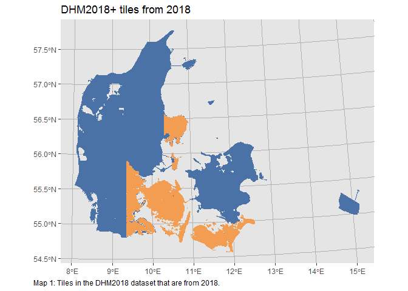
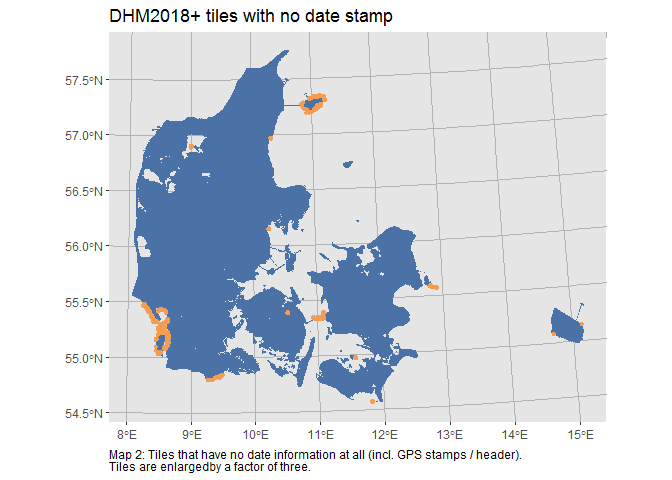
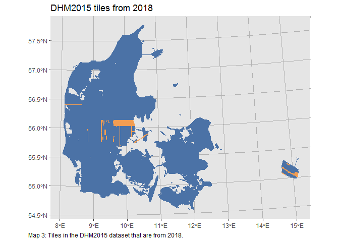
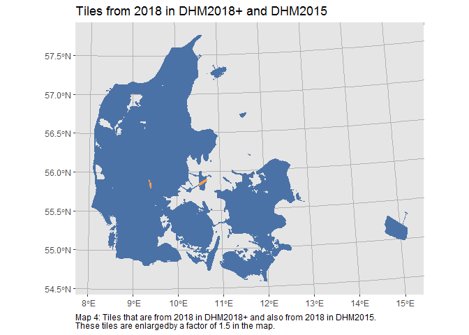
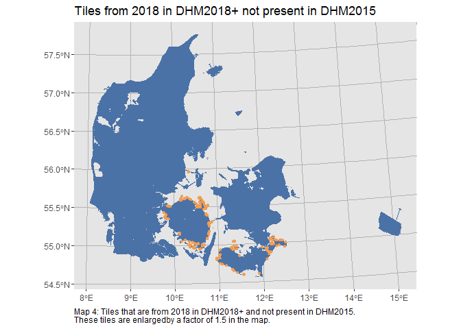
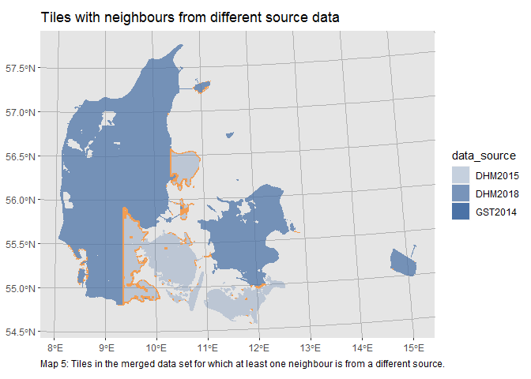

DHM2018+ and DHM2015 merger to create DHM2014/15
================
Jakob J. Assmann <j.assmann@bio.au.dk>
2/11/2021

## Purpose

The purpose of this RMarkdown document is to outline and document how
the DHM2018+, DHM2015 and GST2014 point clouds were merged for the
EcoDes-DK15 processing. The aim was to generate a consistent data set
that contains as much data from 2014/15 as possible.

## Content

1.  [Data prep](#data-prep)
2.  [DHM2018+ overview](#dhm2018-overview)
3.  [DHM2015 overview](#dhm2015-overview)
4.  [GST2014 overview](#gst2014-overview)
5.  [Data set merger and edge id](#data-set-merger-and-edge-id)
6.  [Concluding remarks](#concluding-remarks)

## Data prep

First, we ingest the outputs from Zsofia’s script (extractmeta_v2.R
version from 2/11/2021), which generates metadata for the DHM
pointclouds tiles based on LAStools’ LASinfo.exe and the R lidr package.

Once ingested, we clean up the data, reduce it to the essentials, add an
identifier column for the source data set, remove duplicates and keep
only three of the date related variables on which this merger will be
based.

These three date variables are:

1.  The maximum GPS time stamp of any point in any given tile (as year).
2.  The year created from the LAZ/LAS file header.
3.  A merged date that is set to the GPS time stamp unless it is
    missing, then the year from the header is used.

*Note: A GPS time stamp of 2011 is invalid (i.e., has not been converted
from GPS week to GPS date) and is therefore assigned NA. September 2011
is the most recent time the GPS epoch rolled over in relation to this
data set. Unfortunately, a conversion of time stamps from GPS week to
GPS date is not possible for those time stamps without further knowledge
about the week at which the points were collected. Unfortunately, this
GPS week number is not provided for the point clouds.*

``` r
# Load and clean meta data DHM2018+
dhm2018 <- read_sf("source_meta_data/DHM2018_20211102_1551.shp") %>%
  select(tile_id = BlockID, max_date = MxGpstm, header_year = CreatYr) %>%
  mutate(max_date = as.Date(max_date), 
         max_GPS_year = format(as.Date(max_date), "%Y"),
         data_source = "DHM2018")  %>%
  mutate(year = case_when(max_GPS_year == 2011 ~ header_year,
                          T ~ max_GPS_year)) %>%
  group_by(tile_id) %>%
  filter(n()==1) %>%
  ungroup()
dhm2018$year[dhm2018$year == 0] <- NA

# Load and clean meta data DHM2015
dhm2015 <- read_sf("source_meta_data/DHM2015_punktsky_20211102_1408.shp") %>%
  select(tile_id = BlockID, max_date = MxGpstm, header_year = CreatYr) %>%
  mutate(max_date = as.Date(max_date), 
         max_GPS_year = format(as.Date(max_date), "%Y"),
         data_source = "DHM2015") %>%
  mutate(year = case_when(max_GPS_year == 2011 ~ header_year,
                          T ~ max_GPS_year)) %>%
  group_by(tile_id) %>%
  filter(n()==1) %>%
  ungroup()
dhm2015$year[dhm2015$year == 0] <- NA

# Load and clean meta data GST2014
gst2014 <- read_sf("source_meta_data/GST_2014_20211102_0549.shp") %>%
  select(tile_id = BlockID, max_date = MxGpstm, header_year = CreatYr) %>%
  mutate(max_date = as.Date(max_date), 
         max_GPS_year = format(as.Date(max_date), "%Y"),
         data_source = "GST2014") %>%
  mutate(year = case_when(max_GPS_year == 2011 ~ header_year,
                          T ~ max_GPS_year)) %>%
  group_by(tile_id) %>%
  filter(n()==1) %>%
  ungroup()
gst2014$year[gst2014$year == 0] <- NA
```

## DHM2018+ Overview

We will merge the three data sets based on the DHM2018+ data, as we have
already processed this data set using the EcoDes-DK pipeline. The
DHM2018+ data set was retrieved from
[kortforsyningen.dk](https://www.kortforsyningen.dk) in April 2020, as
outlined on the EcoDes-DK repository.

> Based on the limited metadata available, we believed that the DHM2018+
> data just contained points from 2014/15 or earlier, but upon closer
> inspection we discovered that data from later years was also included.
> Now we know that a large chunk of the more recentdata comes from the
> regional re-surveying of parts of Denmark in 2018.

The DHM2018+ data set is structured as followed:

    ## # A tibble: 6 x 2
    ##   max_GPS_year     n
    ##   <chr>        <int>
    ## 1 2011           189
    ## 2 2013           279
    ## 3 2014         19352
    ## 4 2015         19040
    ## 5 2018         10959
    ## 6 <NA>             1

    ## # A tibble: 5 x 2
    ##   header_year     n
    ##   <chr>       <int>
    ## 1 0             189
    ## 2 2015           87
    ## 3 2017        38469
    ## 4 2018          104
    ## 5 2019        10971

    ## # A tibble: 5 x 2
    ##   year      n
    ##   <chr> <int>
    ## 1 2013    279
    ## 2 2014  19352
    ## 3 2015  19040
    ## 4 2018  10959
    ## 5 <NA>    190

Based on “year” (3. table), we have 10959 tiles for which we have
information that the data is newer than 2015. These are located as
follows:

<!-- -->

We will attempt to source those data from the DHM2015 data set later.

For 190 tiles, we have no information on the potential collection date
at all. Here is an overview on where those tiles are located (note the
size of these tiles is exaggerated by a factor of three to make them
visible):

<!-- -->

The majority of those tiles seem to be along the coastline, so their
influence on data quality for terrestrial, ecological research is likely
small.

To assess what influence on the data quality they might have, we can
have a look at [this file](DHM2018_na_tiles_zoom.png) for a zoom in and
on where exactly those tiles are positioned along the coastline. In this
file the tile sizes are not exaggerated.

The detailed look confirms: except for one tile, all tiles with no date
information are located along the coastlines or in big water bodies. So
even if the data is from an unknown date the impact on terrestrial,
ecological research will be small.

Are all of those “NA tiles” also NA in the DHM2015 data set?

``` r
dhm2015 %>% 
  st_drop_geometry() %>%
  filter(tile_id %in% (dhm2018 %>% 
                         st_drop_geometry() %>%
                         filter(is.na(year)) %>% 
                         pull(tile_id))) %>%
  group_by(year) %>%
  summarise(n = n())
```

    ## # A tibble: 2 x 2
    ##   year      n
    ##   <chr> <int>
    ## 1 2014      1
    ## 2 <NA>    189

No! Only one, but for precaution we should source these “NA tiles” from
the DHM2015 data set anyways. It is more likely that those are from the
2014/15.

**In summary, we will have to replace all tiles that contain data from
2018 and all tiles that have no information on the acquisition date.
Let’s gather the respective tile_ids, so that we can source them from
the DHM2015 data set.**

``` r
 tiles_to_source_from_DHM2015 <- dhm2018 %>%
  filter(year == 2018 | is.na(year)) %>% 
  pull(tile_id)
```

## DHM2015 overview

The DHM2015 data set was downloaded from
[datafordeler.dk](https://www.datafordeler.dk) in October 2021 where it
is called “DHM2015_punktsky” and “DHM2015_terraen”. The download was
done following an email exchange with Andrew Flatman and Peter Petersen
from SDFE who suggested to download this data. According to Andrew and
Peter the data is meant to only include data from 2014/15 and prior
survey years, but according to the GPS time-stamps this is not the case.
Instead, the DHM2015 data set is structured as followed:

    ## # A tibble: 7 x 2
    ##   max_GPS_year     n
    ##   <chr>        <int>
    ## 1 2011          1825
    ## 2 2013           815
    ## 3 2014         26760
    ## 4 2015         19364
    ## 5 2016             1
    ## 6 2017             1
    ## 7 2018          1027

    ## # A tibble: 5 x 2
    ##   header_year     n
    ##   <chr>       <int>
    ## 1 0             196
    ## 2 2014        14776
    ## 3 2015        34612
    ## 4 2016            9
    ## 5 2017          200

    ## # A tibble: 7 x 2
    ##   year      n
    ##   <chr> <int>
    ## 1 2013    815
    ## 2 2014  26771
    ## 3 2015  20982
    ## 4 2016      1
    ## 5 2017      1
    ## 6 2018   1027
    ## 7 <NA>    196

It is a lot more messy than the DHM2018+ data and, unfortunately, the
data set also includes data from 2018!

The tiles with data from 2018 are located here:

<!-- -->

What about those tiles that are from 2018 in the DHM2018+ data set,
which we would like to source from the DHM2015 data set? What does their
acquisition date distribution look like in DHM2015?

    ## # A tibble: 4 x 2
    ##   year      n
    ##   <chr> <int>
    ## 1 2014   6992
    ## 2 2015   3774
    ## 3 2018     43
    ## 4 <NA>    192

The majority of tiles are from 2014/15, which is good. However, there
are a few tiles that are still from 2018, and three that are NA in
addition to the 189 NA tiles that we already know about. The latter
three are not much to worry about, but the 2018 tiles are. Let’s locate
them on a map:

<!-- -->

We will source these data from the GST2014 data set instead.

``` r
# Geather tiles to source from GST2014
tiles_to_source_from_GST2014 <- dhm2015 %>%
  st_drop_geometry() %>%
  filter(tile_id %in% tiles_to_source_from_DHM2015) %>%
  filter(year == 2018) %>%
  pull(tile_id)
# Remove these tiles from the list of tiles to source from DHM2015
tiles_to_source_from_DHM2015 <- tiles_to_source_from_DHM2015[
  !(tiles_to_source_from_DHM2015 %in% tiles_to_source_from_GST2014)]
```

Next, we need to check whether any of the tiles we would like to source
are among the corrupt tiles in the DHM2015 data set (see data set
readme). The point clouds for these tiles threw an error during
extraction from the zipped tile bundles provided by datafordeler.dk.

``` r
dhm2015_corrupt_tiles <- c("6144_576",
                           "6144_577",
                           "6158_532",
                           "6158_533",
                           "6330_541",
                           "6330_542",
                           "6330_543")

sum(tiles_to_source_from_DHM2015 %in% dhm2015_corrupt_tiles)
```

    ## [1] 4

Four of the tiles to source are corrupt in the DHM2015 data set, so we
will try source these from the GST2014 data set instead.

``` r
# Add tiles to list of tiles to source from GST2014
tiles_to_source_from_GST2014 <- c(tiles_to_source_from_GST2014,
                                  tiles_to_source_from_DHM2015[
  tiles_to_source_from_DHM2015 %in% dhm2015_corrupt_tiles])
# Remove these tiles from the list of tiles to source from DHM2015
tiles_to_source_from_DHM2015 <- tiles_to_source_from_DHM2015[
  !(tiles_to_source_from_DHM2015 %in% tiles_to_source_from_GST2014)]
```

Lastly, we need to check whether any tiles that we would like to source
are not present in the DHM2015 data set.

``` r
sum(!(tiles_to_source_from_DHM2015 %in% dhm2015$tile_id))
```

    ## [1] 146

Indeed, there are 146 tiles that are not in the DHM2015 data. Where are
these located?

<!-- -->

And what are their date distributions in the DHM2018+ data set?

``` r
dhm2018 %>% 
  st_drop_geometry() %>%
  filter(tile_id %in%
           tiles_to_source_from_DHM2015[
             !(tiles_to_source_from_DHM2015 %in% 
                 dhm2015$tile_id)]) %>%
  group_by(year) %>%
  summarize(n = n())
```

    ## # A tibble: 1 x 2
    ##   year      n
    ##   <chr> <int>
    ## 1 2018    146

Again, these tiles seem to be clustered mainly along the coast line, so
we expect their impact to be relatively small. As they are all from 2018
(and not NA), we will attempt to source these from the GST2014 data set
also.

``` r
tiles_to_source_from_GST2014 <- c(tiles_to_source_from_GST2014,
                                  tiles_to_source_from_DHM2015[
                                    !(tiles_to_source_from_DHM2015 %in% 
                                        dhm2015$tile_id)])
tiles_to_source_from_DHM2015 <- tiles_to_source_from_DHM2015[
  tiles_to_source_from_DHM2015 %in% 
    dhm2015$tile_id]
```

This leaves us with a final set of tiles to source from DHM2015. The
year distribution of these tiles looks as follows:

``` r
dhm2015 %>% 
  st_drop_geometry() %>% 
  filter(tile_id %in% tiles_to_source_from_DHM2015) %>%
  group_by(year) %>% 
  summarize(n = n())
```

    ## # A tibble: 3 x 2
    ##   year      n
    ##   <chr> <int>
    ## 1 2014   6990
    ## 2 2015   3774
    ## 3 <NA>    192

## GST2014 overview

The GST2014 data set is (at the time point of writing) of uncertain
origin. It is a version of the DHM data set from the 2014/15 campaign
that is found on the Aarhus University’s Section for Ecoinfomartics data
servers. It was most likely downloaded from the Kortforsyining servers
by Peder Klith Boecher, a former member of the section. This download
may have happened shortly after the release of the first version of the
data set and was used by Jesper Moeslund, Andras Zlinszky et al in their
[2019
paper](https://esajournals.onlinelibrary.wiley.com/doi/abs/10.1002/eap.1907).

*Note: There is an issue with the file headers in this GST2014 data set,
affecting approximately half of the point clouds. The issue causes OPALS
to assign a wrong CRS (using the WGS84 ellipsoid rather than the GRS1980
ellipsoid as specified for EPSG 25832). Other point cloud handling
programs (incl.  LAStools and the R lidr package) are able to read the
CRS correctly for these tiles. Therefore the CRS will need to be
overwritten upon import to OPALS using the EcoDes-DK scripts.*

    ## # A tibble: 5 x 2
    ##   max_GPS_year     n
    ##   <chr>        <int>
    ## 1 2007            59
    ## 2 2011             2
    ## 3 2013           282
    ## 4 2014         25948
    ## 5 2015         23289

    ## # A tibble: 3 x 2
    ##   header_year     n
    ##   <chr>       <int>
    ## 1 2014            4
    ## 2 2015            2
    ## 3 2017        49574

    ## # A tibble: 5 x 2
    ##   year      n
    ##   <chr> <int>
    ## 1 2007     59
    ## 2 2013    282
    ## 3 2014  25948
    ## 4 2015  23290
    ## 5 2017      1

*Note: The single tile originating from 2017 in the ‘year’ variable is
an artifact caused by the definition of the variable.*

Most importantly: there is no data from post 2015 in this data set.
However, the uncertainties about the origins of the data and the issues
reading the import of the headers into OPALS means that we would like to
use as little of this data as possible.

Let’s check what the date is of the tiles that we would like to source
from the GST2014 data set:

``` r
gst2014 %>%
  st_drop_geometry() %>%
  filter(tile_id %in% tiles_to_source_from_GST2014) %>%
  group_by(year) %>%
  summarize(n = n())
```

    ## # A tibble: 2 x 2
    ##   year      n
    ##   <chr> <int>
    ## 1 2014     27
    ## 2 2015     49

This looks good!

How many of the tiles we would like to source are not in the GST2014
data set?

``` r
sum(tiles_to_source_from_GST2014 %in% gst2014$tile_id)
```

    ## [1] 76

What is their date distribution in the DHM2018 data set?

``` r
dhm2018 %>% 
  st_drop_geometry() %>%
  filter(tile_id %in% 
           tiles_to_source_from_GST2014[
             !(tiles_to_source_from_GST2014 %in% gst2014$tile_id)
           ]) %>%
  group_by(year) %>%
  summarize(n = n())
```

    ## # A tibble: 1 x 2
    ##   year      n
    ##   <chr> <int>
    ## 1 2018    117

They are exclusively from 2018 and not NA tiles. We will **not** include
these tiles in the merged data set.

``` r
tiles_not_to_include <- tiles_to_source_from_GST2014[
             !(tiles_to_source_from_GST2014 %in% gst2014$tile_id)
           ]
# Update tiles to source from GST2014
tiles_to_source_from_GST2014 <-  tiles_to_source_from_GST2014[
             tiles_to_source_from_GST2014 %in% gst2014$tile_id
           ]
```

## Dataset merger and edge id

> In anticipation of the merger, we had already run one batch of
> re-processing for all tiles that had a mode of the GPS stamp that fell
> into 2018 (EcoDes-DK “date_stamp” variable). We therefore only need to
> reprocess the additional tiles that were not already included in the
> re-processing and all those tiles that are on the edges between the
> two data sets (to account for edge effects). This section will
> identify those.

Let’s start by merging the data sets based on our tiles_to_source
vectors:

``` r
# Merge the data to later identify the edges
dhm_merged <- bind_rows(
  filter(dhm2018, !(tile_id %in% c(tiles_to_source_from_GST2014,
                                   tiles_to_source_from_DHM2015,
                                   tiles_not_to_include))),
  filter(gst2014, tile_id %in% tiles_to_source_from_GST2014),
  filter(dhm2015, tile_id %in% tiles_to_source_from_DHM2015)
  )

# Export tile_ids to files for file copying later
write_csv(data.frame(tile_id = tiles_to_source_from_GST2014), 
          "tiles_from_GST2014.csv")
write_csv(data.frame(tile_id = tiles_to_source_from_DHM2015), 
          "tiles_from_DHM2015.csv")
dhm2018 %>% 
  filter(!(tile_id %in% c(tiles_to_source_from_GST2014,
                          tiles_to_source_from_DHM2015,
                          tiles_not_to_include))) %>%
  st_drop_geometry() %>%
  select(tile_id) %>%
  write_csv("tiles_from_DHM2018.csv")
```

The data breaks down as follows:

``` r
dhm_merged %>% 
  group_by(data_source) %>%
  summarize(n = n())
```

    ## Simple feature collection with 3 features and 2 fields
    ## Geometry type: MULTIPOLYGON
    ## Dimension:     XY
    ## Bounding box:  xmin: 441000 ymin: 6049100 xmax: 894000 ymax: 6403000
    ## Projected CRS: ETRS89 / UTM zone 32N
    ## # A tibble: 3 x 3
    ##   data_source     n                                                     geometry
    ##   <chr>       <int>                                           <MULTIPOLYGON [m]>
    ## 1 DHM2015     10956 (((545000 6078000, 545000 6078000, 544000 6078000, 544000 6~
    ## 2 DHM2018     38671 (((491000 6082745, 490000 6082745, 490000 6082746, 489000 6~
    ## 3 GST2014        76 (((615747.2 6123904, 615747.2 6123000, 615000 6123000, 6150~

Next, we find out which cells have at least one neighbour from the other
source data set, so that we can reprocess them to avoid edge effects.

``` r
# Helper function to scan neigbhourhood for DHM2018 tiles
find_neighbours <- function(tile_id1){
  tile_row <- gsub("([0-9]{4})_([0-9]{3})", "\\1", tile_id1) %>% as.numeric()
  tile_col <- gsub("([0-9]{4})_([0-9]{3})", "\\2", tile_id1) %>% as.numeric()
  tile_list <- expand.grid(row = seq(tile_row - 1, tile_row + 1), 
                           col = seq(tile_col - 1, tile_col + 1)) 
  tile_list <- paste0(tile_list$row, "_", tile_list$col)
  source <- dhm_merged %>% 
    st_drop_geometry() %>%
    filter(tile_id == tile_id1) %>%
    pull(data_source)
  neighbours_diff_source <- dhm_merged %>% 
    filter(tile_id %in% tile_list) %>% 
    st_drop_geometry() %>% 
    filter(data_source != source) %>% 
    summarize(n = n()) %>% 
    pull(n)
  return(neighbours_diff_source)
} 

# Get the number of neighbours for the tile_ids using the helper function
cl <- makeCluster(32)
sink_vector <- capture.output(clusterEvalQ(cl, {
  library(dplyr)
  library(sf)}))
rm(sink_vector)
clusterExport(cl, "dhm_merged")
dhm_merged$n_neighbour_diff_source <- dhm_merged$tile_id %>%
  pblapply(find_neighbours, cl = cl) %>% 
  unlist()
stopCluster(cl)
```

``` r
# Filter tiles with at least one neighbour
tiles_with_neighbour_diff_source <- dhm_merged %>%
  filter(n_neighbour_diff_source > 0) %>%
  pull(tile_id)

# Print out length
length(tiles_with_neighbour_diff_source)
```

    ## [1] 2362

These 2362 tiles will have to be reprocessed in either case. Their
locations are here:

<!-- -->

Let’s just save this merged meta data as a shapefile:

``` r
write_sf(dhm_merged,
         "meta_data/dhm_merged.kml")
```

Next, let’s look at which tiles have already been re-processed, and how
many of the tiles_to_source have not been reprocessed yet:

``` r
tiles_processed <- read_csv("2018_tiles_available.csv")
```

Tiles in tiles_to_source_from_DHM2015 which have been processed already:

``` r
length(tiles_to_source_from_DHM2015[
  (tiles_to_source_from_DHM2015 %in% tiles_processed$tile_id)])
```

    ## [1] 10082

Tiles in tiles_to_source_from_DHM2015 which **still need to be
processed**:

``` r
tiles_to_process <- tiles_to_source_from_DHM2015[!(tiles_to_source_from_DHM2015 %in% tiles_processed$tile_id)]
length(tiles_to_process)
```

    ## [1] 874

Finally, we combine these tiles to process with the tiles to source from
the GST2014 data set and with those tiles that have a neighbour form a
different source, and remove redundancies.

This makes our final set of tiles to be re-processed:

``` r
tiles_to_process <- c(tiles_to_process, 
                      tiles_to_source_from_GST2014,
                      tiles_with_neighbour_diff_source) %>%
  unique()
length(tiles_to_process)
```

    ## [1] 2735

``` r
write_csv(data.frame(tile_id = tiles_to_process),
          "tiles_to_process_dhm201415_merger.csv")
```

The data brakes down as follows:

``` r
dhm_merged %>%
  st_drop_geometry() %>%
  filter(tile_id %in% tiles_to_process) %>%
  group_by(data_source) %>%
  summarize(n = n())
```

    ## # A tibble: 3 x 2
    ##   data_source     n
    ##   <chr>       <int>
    ## 1 DHM2015      1691
    ## 2 DHM2018       968
    ## 3 GST2014        76

## Concluding remarks

The circumstances provided us with source data sets that were messy and
required us to carry out this awkward merger. I hope this document
provides a clear overview on what was done and how the merger was
carried out.

The remaining tasks to do are: 1) to physically merge the two data sets
and 2) re-run the EcoDes-DK workflow for the tiles that still need to be
processed. Then 3) the processed tiles from all the different data sets
(the original EcoDes-DK data based on the DHM2018+ data set, the
re-processed data from the initial re-processing step and the newly
re-processed data.) will need to be merged. To carry out these steps,
please see the references to the relevant scripts in the accompanying
readme file.
