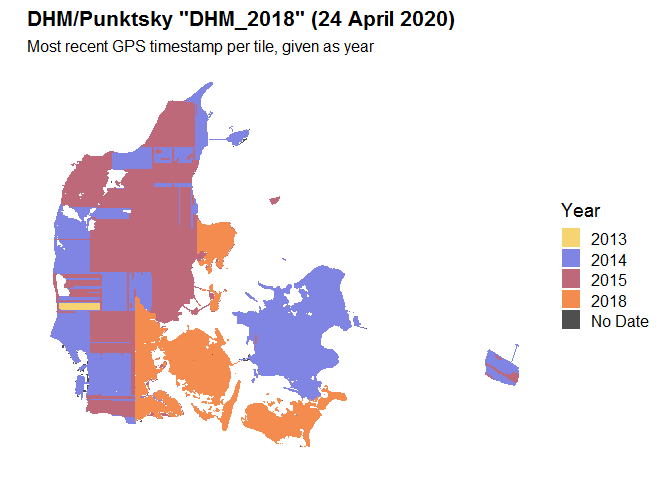
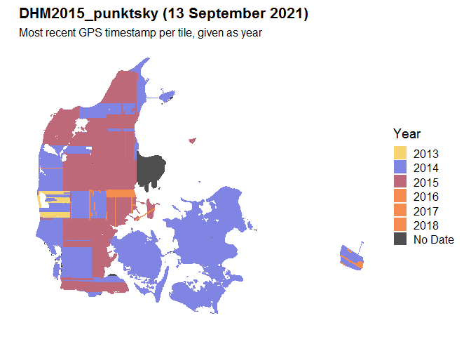
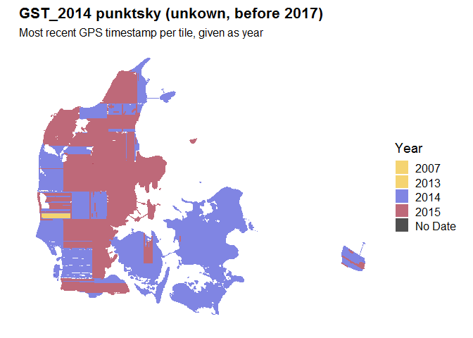
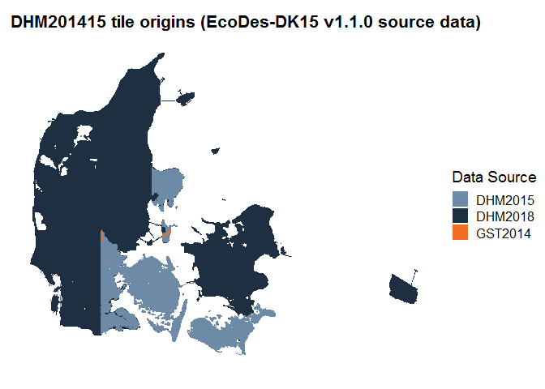
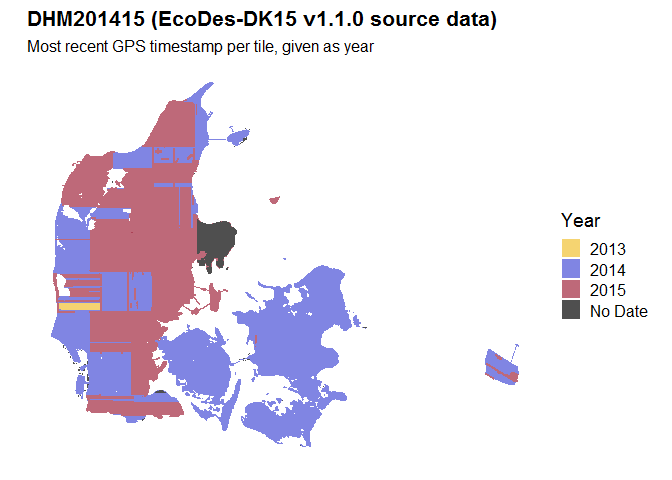

EcoDes-DK15 v1.1.0 Source Data
================
Jakob J. Assmann
3/12/2021

This document describes the source data for the EcoDes-DK15 v1.1.0 data
set.

## Overview

To our best knowledge (and despite frequent attempts to contact the
relevant authorities), at the time point of writing (3 December 2021),
there are no publicly available versions of the Danish national point
cloud (DHM/Punktsky) and terrain model (DHM/Terraen) that contain only
data from the 2014/15 survey campaigns. As consistency in survey timing
was key for our endeavour to create a data set of ecological descriptors
for Denmark that is comparable across the nation, we opted for creating
our own version of the source data set that would contain as much data
as possible from the 2014/15 surveys, with no data from later surveys
and as little data as possible from earlier surveys. This document
provides an overview on this source data set and the versions of the
publicly available DHM/Punktsky and DHM/Terraen data sets on which it is
based.

We used the following three versions of DHM/Punktsky and DHM/Terraen,
all provided by the Danish Agency for Data Supply and Efficiency (SDFE):

## DHM/Punktsky and DHM/Terraen “DHM_2018”

Download: 24 April 2020 from kortforsyningen.dk

This version of the point cloud / terrain model was downloaded from the
https web interface of the <https://kortforsyningen.dk> website as
outlined in the download instructions on the EcoDes-DK15 GitHub
code-repository. The download completed on the 24 April 2020. At the
time point of the download (and writing) the data on kortforyiningen.dk
was not versioned. To our current understanding, the data is
continuously updated with new data from recent / current survey flights
(these were started again in 2018 following a break after 2015).

Based on the GPS time stamps, the version of the point cloud downloaded
in April 2020 contains data from 2007 through to 2018.

<!-- -->

Please note that EcoDes-DK15 v1.0.0 was solely based on this data.

## DHM2015_punktsky and DHM_2015_terraen

Download: 13 September 2021 from datafordeler.dk

This version of the data sets was downloaded from
<https://datafordeler.dk> after contacting Andrew Flatman and Peter
Bartels at SDFE, who recommended this version of the data sets that
supposedly stem from 2014/15. The data can be accessed via the
datafordeler.dk system. The data is available for openly, but the user
will have to register and order the data. The data can then be
downloaded via ftp. A detailed description on how to access the
datafordeler system is provided (in Danish) in the support section on
the datafordeler website. The data sets downloaded by us were
“DHM2015_punktsky” version 1.0.0 and “DHM2015_terraen” version 1.0.0. We
completed the download on the 13 September 2021.

Based on the GPS time stamps, this version of the point cloud contains
data from 2007 through to 2018. It also contains large regions where no
GPS time is provided. Based on auxiliary information (point source ids /
flight line) and comparison with the GST_2014 version of the point
cloud, we know that the affected regions in the Mols Bjerge and
Sønderborg areas were surveyed in April-May 2015 and October 2014,
respectively.

<!-- -->

## GST_2014 punktsky and DTM

Download: unknown (before 2017) from kortforsyningen.dk

The GST_2014 version of the data sets is (at the time point of writing)
of uncertain origin. Hence, we tried to rely on them as little as
possible for the merger. The data sets are from the 2014/15 campaign and
can be found on the Aarhus University’s Section for Ecoinfomartics
internal data servers. It was most likely downloaded from the
Kortforsyining servers (akin to the April 2020 version) by Peder Klith
Boecher, a former member of the section. This download may have happened
shortly after the release of the first version of the data sets
following the 2014/15 surveys and was used by Jesper Moeslund, Andras
Zlinszky et al in their [2019
paper](https://esajournals.onlinelibrary.wiley.com/doi/abs/10.1002/eap.1907).

In addition to the uncertainty about the origins of the data sets, there
is an issue with the headers of approximately half of the laz point
clouds which prevents the CRS to be read correctly into OPALS 2.3.2.0.
Manual assignment of the CRS is required in those cases. Another reason
for why we were careful not to rely too heavily on this data set for the
source data.

Based on the GPS time stamps, this version of the point cloud contains
data from 2007 through to 2015.

<!-- -->

------------------------------------------------------------------------

## Merger to create EcoDes-DK15 v1.1.0 source data

We merged the three versions of the data sets above into one version
containing as much as 2014/15 data as possible, with no data from after
2015 and as little data prior 2014 as possible. The merger was done
hierarchically in the above presented order (DHM_2018, DHM_2015,
GST2014). We started with DHM_2018, identified all point cloud tiles
with a GPS max time stamp from 2018 and sourced those from DHM_2015. We
then checked the tiles from DHM2015 and excluded all tiles from 2018,
sourcing those from GST_2014. The exact procedure is describe in [this
report](/documentation/source_data/dhm201415_merger.md). Lastly, we
removed all tiles that did not have a complete pair of point cloud and
terrain model files. The result is a final version of the source data
sets (point clouds and paired terrain model tiles) optimised in
collection time for the EcoDes-DK15 v1.1.0 descriptors.

## EcoDes-DK15 v1.1.0 source data

The final merger of the source data included 38671 tiles (point clouds
and paired terrain model rasters) from the DHM/Punktsky data sets, 10955
tiles from DHM2015_punktsky and 47 tiles from GST_2014.

<!-- -->

The final source data set contains data from 2007 through to 2015 (all point classes) and no vegetation points prior 2013, with the maximum date in all tiles not exceeding 2015 (all points). 

<!-- -->

## Source data storage and access

All source data sets (DHM_2018, DHM_2015, GST2014 and DHM201415), including 
both point clouds and terrain model rasters are archived on the internal 
long-term data repositories of Aarhus University. All data is available on 
request. For access, please contact PI Signe Normand (signe.normand@bio.au.dk).

## Files contained in this folder

    redme.md                            # This file.
    readme.Rmd                          # Source file for this readme
    
    dhm201415_merger.Rmd                # RMarkdown script documenting merger of source data sets
    DHM2018_na_tiles_zoom.png           # Image figure dhm201415_merger.Rmd   
    dhm201415_merger.md	                # Output of dhm201415_merger.Rmd
    
    DHM201415_meta_data.geojson         # Meta data for merged source data DHM201415
    DHM2015_punktsky_meta_data.geojson  # Meta data for DHM2015
    DHM_punktsky_meta_data.geojson      # Meta data for DHM2018
    GST_2014_meta_data.geojson          # Meta data for GST2014 
    
    merger_log/                                         # Log files from merger
             |- 2018_tiles_available.csv                # DHM2018 tiles already pre-processed
             |- checkusm_errors.csv                     # Checksum errors after merging the outputs 
             |- final_merger_missing_files.csv          # Missing tiles after merging the outputs
             |- final_output_merger_qc.txt              # Summary stats missing tiles after merging outputs  
             |- incomplete_tile_pairs.csv               # Tile pairs not complete after merger
             |- tiles_from_DHM2015.csv                  # Tiles sourced from DHM2015
             |- tiles_from_DHM2018.csv                  # Tiles sourced from DHM2018
             |- tiles_from_GST2014.csv                  # Tiles sourced from GST2014
             |- tiles_to_process_dhm201415_merger.csv   # Tiles requiring re-processing
    merger_scripts/ 
             |- check_merged_outputs.py                 # Script to check merger of outputs
             |- copy_files.py                           # Script to merge source data sets
             |- extractmeta_v2.R                        # Zofia Koma's script used to generate meta data
             |- merge_outputs.py                        # Script to merge output data sets
    
    readme-files/                                       # Image files for this readme
    
    dhm201415_merger_files/                             # Image files for the dhm201415_merger.md report
