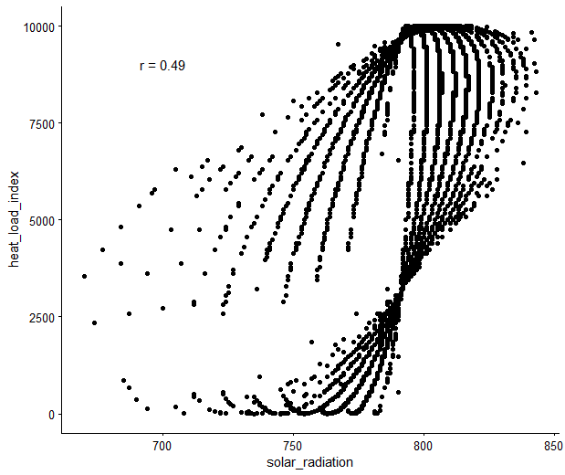

# DK Nation-wide LiDAR Variable Descriptions

*Version 0.6*

*Work in progress...*

**Authors:** Jakob J. Assmann, Urs A. Treier, Andràs Zlinsky, Jesper E. Moeslund and Singe Normand

## Content
- [Dataset Description](#dataset-description)
- [Overview](#overview)
- [Point cloud derived variables](#point-cloud-derived-variables)
- [Terrain model derived variables](#terrain-model-derived-variables)
- [Auxiliary files](#auxiliary-files)

## Dataset Description

This dataset contains ecological and landscape descriptors extracted from the point clouds of Denmark's nationwide LiDAR dataset *'Punktsky'* collected in winter 2014/15. The raw point clouds can be accessed on the website of [Kortforsyningen](#https://download.kortforsyningen.dk/content/dhmpunktsky) and documentation for the raw data is available [here](#https://kortforsyningen.dk/sites/default/files/old_gst/DOKUMENTATION/Data/dk_dhm_punktsky_v2_jan_2015.pdf) and [here](#https://sdfe.dk/hent-data/danmarks-hoejdemodel/).

The purpose of this dataset is to provide a light-weight version of the nationwide data condensed into easyly interpretable descriptors, which summarise the structure of the point cloud data for ecological and biological studies. As the data was collected in winter 2014/15 the data provides a snapshot of Denmark at that time, since then changes are likely to have occurred.

The extent of the dataset comprises the majority of the Danish land surface (including many of the small islands and Bornholm) split into 49 835 tiles. The data is provided as GeoTIFF rasters projected in ETRS 96 UTM32 (EPSGS:7019). NoData values are globally set to -9999, but please see the description on how to interpret the NoData cells for the individual variables. Masks for sea and small in-land water bodies are provided, but have to be applied manually where appropriate.

This document describes the 14 ecological and landscape variables extracted by us and how they were derived. We also highlight any known issues relevant to the interpretation of these variables.

## Overview
The section provides a quick overview of all outputs and auxiliary files.

**Point cloud derived variables**

The data source for these variables are the raw point clouds provided by Kortforsyningen.

| variable name | average file size | average processing time |
| ---- | ---- | ---- |
| [amplitude\_mean and amplitude\_sd](#amplitude_mean-and-amplitude_sd) | 46 kb (2x) | 75 s |
| [canopy\_height](#canopy_height) | 42 kb | 51 s |
| [normalized\_z\_mean and normalized\_z\_sd](#normalized_z_mean-and-normalized_z_sd)| 50 kb (2x) | 60 s |
| [point\_counts](#point_counts) | 10 kb (28 x) | 25 min (50 s per count) |
| [point\_source\_info](#point_source_info) | 110 kb (4x) | 5 min 10 s |
| [proportions](#proportions) | 19 kb (25x) | 35 s |

**Terrain model derived variables**

The data source for these variables are digital terrain model (DTM) rasters ultimately derived from the raw point clouds at a 0.4 m grain size. These 0.4 m DTM rasters are directly provided by Kortforsyningen and can be found [here](#https://download.kortforsyningen.dk/content/dhmterr%C3%A6n-04-m-grid).

| variable name | average file size | average processing time |
| ---- | ---- | ---- |
| [aspect](#aspect) | 20 kb | 9 s |
| [dtm\_10m](#dtm_10m) | 20 kb | 2 s |
| [heat\_load\_index](#heat_load_index) | 20 kb | 1 s |
| [openness\_difference](#openness_difference) | 20 kb | 5 s |
| [openness\_mean](#openness_mean) | 20 kb | 5 s |
| [slope](#slope) | 20 kb | 8 s |
| [solar\_radiation](#solar_radiation) | 20 kb | 4 s |
| [twi](#twi) | 20 kb | 25 s |

**Note:** Processing times are given per tile on a single core and are provided for development purposes only **[to be removed in final documentation]**. The time does not include time penalties for processes and file management or benefits from multicore parallel processing.

For all 49k tiles the processing took around 45 days for the first complete run through using 54 parallel threads on a dedicated machine with 2 x Intel Xenon Platinum 8180 @2.5GHz, 1.5 TB Ram (little used), a fast access RAID and Windows Server 2012 R2. An additional week was needed for re-processing of some of the digital terrain model variables.

The total data volume of the outputs is around 80 GB.

**Auxiliary Files**

Files to support data access and handling.

| file name | description |
| ---- | ---- |
| [water masks](#water-masks) | Sea and inland water masks for each tile |
| [tile footprints](#tile-footprints) | Tile footprints, allows for targeted subsetting of dataset |
| [vrt files](#vrt-files) | VRT files (virtual mosaic file) for each variable |

[Back to content.](#content)

----
## Point cloud derived variables

### amplitude\_mean and amplitude\_sd
**Folder locations:** `/outputs/amplitude/mean` and `/outputs/amplitude/sd`

**File names:** `amplitude_mean_xxxx_xxx.tif` and `amplitude_sd_xxxx_xxx.tif`

**File type and units:** `32-bit float, undefined`

**Description:**

Arithmetic mean and standard deviation of the return amplitude for all points within a 10 m x 10 m grid cell.

In the context of LiDAR, the amplitude represents the strength of the signal received by the sensor for each return. For this variable the arithmetic mean and standard deviation of the amplitude were calculated for all points within a 10 m x 10 m cell. Calculations were carried out for a single tile using the [OPALS Cell module](https://opals.geo.tuwien.ac.at/html/stable/ModuleCell.html). Here, all points refers exactly to the following set of classes: ground, water, building, as well as low\-, medium\- and high\-vegetation.  

**Issues:**
- The interpretation of the amplitude variable is not straightforward and its biological meaning can be complex. Nonetheless, the amplitude is sensitive to moisture and captures texture, it can therefore be highly useful for segmenting vegetated and non-vegetated surfaces.
- Amplitude is not directly comparable across flight strips due to differences in sensor etc. As some cells may contain returns from up to four different flight strips, we recommend using the amplitude variable in conjunction with information on the flight strip ids within each cell contained in the point\_source\_info variables.

**References:**
No specific references available.

[Back to content.](#content)

----
### canopy\_height
**Folder location:** `/outputs/canopy_height`

**File name:** `canopy_height_xxxx_xxx.tif`

**File type and units:** `16 bit integer, metre x 100`

**Description:**

Canopy height calculated as the 95th-percentile of the normalised height above ground of all vegetation points within a 10 m x 10 m cell.

Calculated with [OPALS Cell](https://opals.geo.tuwien.ac.at/html/stable/ModuleCell.html) for each tile individually. Vegetation points consist of the following classes: low\-, medium\- and high\- vegetation. Should there be no vegetation points in any given cell the value of the cell is set to zero.

**Issues:**
- If a cell contains no points the value is set to zero, not NA.
- In rare cases, this variable might lead to erroneous canopy-height readings if vegetation is found on artificial structures. The canopy height is calculated even if there is only a small amount of vegetation returns in a cell. For example: A tall communications tower can be found just south of Aarhus. On top of this tower small patches of vegetation resulted in vegetation point returns. The canopy height for this cell is > 100 m. The building proportion variable may help in identifying such cases.

**References:**
No specific references available.

[Back to content.](#content)

----
### normalized\_z\_mean and normalized\_z\_sd
**Folder locations:** `/outputs/normalized_z/mean` and `/outputs/normalized_z/sd`

**File names:** `normalized_z_mean_xxxx_xxx.tif` and `normalized_z_sd_xxxx_xxx.tif`

**File type and units:** `16-bit integer, metre x 100` and `16-bit integer, metre x 100`

**Description:**

Arithmetic mean and standard deviation of the mean height above ground (normalised z) for all points in a 10 m x 10 m grid cell.

A normalised z attribute for each point were added to the point cloud of a single tile using [OpalsAddInfo](https://opals.geo.tuwien.ac.at/html/stable/ModuleAddInfo.html). To do so the absolute height above sea-level of a point was subtracted by the absolute height of the underlying cell of the 0.4 m digital terrain model. The arithmetic mean and standard deviation of the normalized_z were then calculated for all points within a 10 m x 10 m cell. These calculations were carried out with the [OPALS Cell module](https://opals.geo.tuwien.ac.at/html/stable/ModuleCell.html). Here, all points refers to the following set of classes: ground, water, building, as well as low\-, medium\- and high\-vegetation (classes 2,3,4,5,6,9).  

The American spelling of the variable name is kept for legacy reasons.

**Issues:**
- If a cell contains no points the value is set to zero, not NA.

**References:**
No specific references available.

[Back to content.](#content)

----
### point\_counts
**Folder locations:** `/outputs/point_count/point_count_name`

**File names:** `point_count_name_xxxx_xxx.tif`

**File type and units:** `16-bit integer, absolute count`

**Description:**

Absolute number of points within a 10 m x 10 m cell. Extracted for a combination of point classes and above height ranges specified below.

The "punktsky" point clouds were pre-classified by Geodatasyrelsen. The following point counts were extracted using the [OPALS Cell module](https://opals.geo.tuwien.ac.at/html/stable/ModuleCell.html) with filters applied for the respective height ranges and point classes.

**General point counts:**

| name | height range | point classes |
| ---- | ---- | ---- |
| ground\_point\_count\_\-01m\-01m | \-1 m to 1 m | ground points (class 2) |
| water\_point\_count\_\-01m\-01m | \-1 m to 1 m | water points (class 9) |
| ground\_and\_water\_point\_count\_\-01m\-01m | \-1 m to 1 m | ground and water points (classes 2,9) |
| vegetation\_point\_count\_00m\-50m | 0 m to 50 m | vegetation points (classes 3,4,5) |
| building\_point\_count\_\-01m\-50m | \-1 m to 50 m | building points (class 6) |
| total\_point\_count\_\-01m\-50m | \-1 m to 50 m | ground, water, vegetation and building points (classes 2,3,4,5,6,9) |

**Vegetation point counts for height bins:**
| name | height range | point classes |
| ---- | ---- | ----|
| vegetation\_point\_count\_00.0m\-00.5m | 0.0 m to 0.5 m | vegetation points (classes 3,4,5) |
| vegetation\_point\_count\_00.5m\-01.0m | 0.5 m to 1.0 m | vegetation points (classes 3,4,5) |
| vegetation\_point\_count\_01.0m\-01.5m | 1.0 m to 1.5 m | vegetation points (classes 3,4,5) |
| vegetation\_point\_count\_01.5m\-02.0m | 1.5 m to 2.0 m | vegetation points (classes 3,4,5) |
| vegetation\_point\_count\_02m\-03m | 2 m to 3 m | vegetation points (classes 3,4,5) |
| vegetation\_point\_count\_03m\-04m | 3 m to 4 m | vegetation points (classes 3,4,5) |
| vegetation\_point\_count\_04m\-05m | 4 m to 5 m | vegetation points (classes 3,4,5) |
| vegetation\_point\_count\_05m\-06m | 5 m to 6 m | vegetation points (classes 3,4,5) |
| vegetation\_point\_count\_06m\-07m | 6 m to 7 m | vegetation points (classes 3,4,5) |
| vegetation\_point\_count\_07m\-08m | 7 m to 8 m | vegetation points (classes 3,4,5) |
| vegetation\_point\_count\_08m\-09m | 8 m to 9 m | vegetation points (classes 3,4,5) |
| vegetation\_point\_count\_09m\-10m | 9 m to 10 m | vegetation points (classes 3,4,5) |
| vegetation\_point\_count\_10m\-11m | 10 m to 11 m | vegetation points (classes 3,4,5) |
| vegetation\_point\_count\_11m\-12m | 11 m to 12 m | vegetation points (classes 3,4,5) |
| vegetation\_point\_count\_12m\-13m | 12 m to 13 m | vegetation points (classes 3,4,5) |
| vegetation\_point\_count\_13m\-14m | 13 m to 14 m | vegetation points (classes 3,4,5) |
| vegetation\_point\_count\_14m\-15m | 14 m to 14 m | vegetation points (classes 3,4,5) |
| vegetation\_point\_count\_15m\-16m | 15 m to 16 m | vegetation points (classes 3,4,5) |
| vegetation\_point\_count\_16m\-17m | 16 m to 17 m | vegetation points (classes 3,4,5) |
| vegetation\_point\_count\_17m\-18m | 17 m to 18 m | vegetation points (classes 3,4,5) |
| vegetation\_point\_count\_18m\-19m | 18 m to 19 m | vegetation points (classes 3,4,5) |
| vegetation\_point\_count\_19m\-20m | 19 m to 20 m | vegetation points (classes 3,4,5) |
| vegetation\_point\_count\_20m\-25m | 20 m to 25 m | vegetation points (classes 3,4,5) |
| vegetation\_point\_count\_25m\-50m | 25 m to 50 m | vegetation points (classes 3,4,5) |

**Additional information:**


**Figure:** A set of canopy examples for visualisation of the point count variables. The approximate height of large bounding boxes is 25 m. a) agricultural field with no / very low vegetation, b) understory / shrub layer in mixed broadleaf woodland, c) dense young-ish coniferous forest (plantation?), d) old and tall mixed broadleaf woodland.


**Figure:** Example of the behaviour of returns from shallow waters in a forest pond / marsh area. a) perspective view of the forest pond (pink bounding box has a 10 m x 10 m footprint), b) orthophotograph at nadir view, c) point count intensity of the derived water point count variable (black = low count, white = heigh count), d) nadir view of point cloud. Please notice particularly the many missing returns from the regions in the pond with deep water.

**Issues:**
- Water returns only come from shallow water and even these may not be consistent.
- This might introduce inaccuracies and edge effects associated with water bodies.
- Any empty cell (e.g. over deep water) will return zero for all point counts and not NA.

**References:**
- Point classification outlined in: Geodatastyrelsen 2015. Danmarks Højdemodel, DHM/Punktsky Data version 2.0 - Januar 2015. Accessed online [7 March 2020]. https://kortforsyningen.dk/sites/default/files/old_gst/DOKUMENTATION/Data/dk_dhm_punktsky_v2_jan_2015.pdf

[Back to content.](#content)

----

### point\_source\_info
**Folder locations:**
- `/outputs/point_source_info/point_source_counts/`
- `/outputs/point_source_info/point_source_ids/`
- `/outputs/point_source_info/point_source_nids`
- `/outputs/point_source_info/point_source_proportion`

**File name:** `point_source_info_name_xxxx_xxx.tif`

**Filte type and units:**
- `point_source_counts - 16 bit integer, count`
- `point_source_ids - 16 bit integer, flight strip ID`
- `point_source_nids - 16 bit integer, count`
- `point_source_proportion - 16 bit integer, ratio x 10000`

**Description:**

Four descriptor variables for the points sources (flight strip ids) in each 10 m x 10 m cell.

This information may be helpful for interpreting any variable that might be affected by the flight strip id as a covariate. The flight strip id represents: a) differences between sensors / aircrafts that may have been used during the nationwide LiDAR campaign, b) differences in acquisition time and date, c) differences in view point / acquisition angle of the cells.

- `point_source_counts` \- Contains the number of points per 10 m x 10 m cell for each flight strip id in a tile. In this multi-layer raster each layer represents the point counts for one flight strip id in the tile. The order of layers matches those in the `point_source_ids` raster, which can be used for matching the point counts to the flight strip ids.
- `point_source_ids` \- Multi-layer raster containing one layer for each flight strip found in a tile. The presence of a point of the relevant flight strip is indicated by the presence of a string containing the flight strip id in the cell. This layer can be used to match the layers of the `point_source_counts` and `point_source_proportions` layers to a flight strip id.
- `point_source_nids` \- Single layer raster containing the number of different point source ids in each cell.
- `point_source_proportions` \- Multi-layer raster containing the proportion of point counts for a given point source id per 10 m x 10 m cell. The order of layers corresponds to those in `point_source_ids`, which can be used to match the proportions to a given point source id.

**Issues:**
No known issues so far.

**References:**
No relevant references.

[Back to content.](#content)

----

### proportions
**Folder locations:** `/outputs/proportion/proportion_name`

**File names:** `proportion_name_xxxx_xxx.tif`

**File type and units:** `16-bit integer, ratio x 10000`

**Description:**

Simple ratios between selected [point counts](#point\_counts) for each 10 m x 10 m cell.

**General proportions:**
| name | ratio |
| ---- | ---- |
| canopy\_openness | ground and water points (\-1 m to 1 m; classes 2,9) / all points (\-1 m to 50 m; classes 2,3,4,5,6,9) |
| vegetation\_density | vegetation points (0 m to 50 m; classes 3,4,5) / all points (\-1 m to 50 m; classes 2,3,4,5,6,9) |
| building\_proportion | building points (\-1 m to 50 m; class 6) / all points (\-1 m to 50 m; classes 2,3,4,5,6,9) |

**Vegetation proportions for height bins:**

These proportions were calculated between the vegetation point count in the respective height bin and the total vegetation point count (0 m to 50 m) in a cell. Vegetation points refer to classes 3, 4 and 5.

| name | height range |
| ---- | ---- |
| vegetation\_proportion\_00.0m-00.5m | 0.0 m to 0.5 m |
| vegetation\_proportion\_00.5m-01.0m | 0.5 m to 1.0 m |
| vegetation\_proportion\_01.0m-01.5m | 1.0 m to 1.5 m |
| vegetation\_proportion\_01.5m-02.0m | 1.5 m to 2.0 m |
| vegetation\_proportion\_02m-03m | 2 m to 3 m |
| vegetation\_proportion\_03m-04m | 3 m to 4 m |
| vegetation\_proportion\_04m-05m | 4 m to 5 m |
| vegetation\_proportion\_05m-06m | 5 m to 6 m |
| vegetation\_proportion\_06m-07m | 6 m to 7 m |
| vegetation\_proportion\_07m-08m | 7 m to 8 m |
| vegetation\_proportion\_08m-09m | 8 m to 9 m |
| vegetation\_proportion\_09m-10m | 9 m to 10 m |
| vegetation\_proportion\_10m-11m | 10 m to 11 m |
| vegetation\_proportion\_11m-12m | 11 m to 12 m |
| vegetation\_proportion\_12m-13m | 12 m to 13 m |
| vegetation\_proportion\_13m-14m | 13 m to 14 m |
| vegetation\_proportion\_14m-15m | 14 m to 14 m |
| vegetation\_proportion\_15m-16m | 15 m to 16 m |
| vegetation\_proportion\_16m-17m | 16 m to 17 m |
| vegetation\_proportion\_17m-18m | 17 m to 18 m |
| vegetation\_proportion\_18m-19m | 18 m to 19 m |
| vegetation\_proportion\_19m-20m | 19 m to 20 m |
| vegetation\_proportion\_20m-25m | 20 m to 25 m |
| vegetation\_proportion\_25m-50m | 25 m to 50 m |

**Issues:**
- Mathematically invalid divisons may occur (i.e. division by zero) if a cell is empty for the point class in the denominator of the ratio. In this case a value of zero is assigned to the cell and not NA.

**References:**
- van Leeuwen, M., Nieuwenhuis, M., 2010. Retrieval of forest structural parameters using LiDAR remote sensing. Eur J Forest Res 129, 749–770. https://doi.org/10.1007/s10342-010-0381-4
- Sasaki, T., Imanishi, J., Ioki, K., Morimoto, Y., Kitada, K., 2008. Estimation of leaf area index and canopy openness in broad-leaved forest using an airborne laser scanner in comparison with high-resolution near-infrared digital photography. Landscape Ecol Eng 4, 47–55. https://doi.org/10.1007/s11355-008-0041-8
- Sasaki, T., Imanishi, J., Ioki, K., Song, Y., Morimoto, Y., 2016. Estimation of leaf area index and gap fraction in two broad-leaved forests by using small-footprint airborne LiDAR. Landscape Ecol Eng 12, 117–127. https://doi.org/10.1007/s11355-013-0222-y
- Melin, M., Hinsley, S.A., Broughton, R.K., Bellamy, P., Hill, R.A., 2018. Living on the edge: utilising lidar data to assess the importance of vegetation structure for avian diversity in fragmented woodlands and their edges. Landscape Ecol 33, 895–910. https://doi.org/10.1007/s10980-018-0639-7

[Back to content.](#content)

----
## Terrain model derived variables

### aspect
**Folder location:** `/outputs/aspect`

**File name:** `aspect_xxxx_xxx.tif`

**File type and units:** `16-bit integer, degrees x 10`

**Description:**

Aspect in degrees (stretched by a factor of 10) with 0° indicating North, 90° East, 180° South and 270° West. Flat areas were assigned an aspect of 0°. Values represent the aspect derived from the 10 m x 10 m aggregated DTM.

Calculated using [`gdaldem aspect`](https://gdal.org/programs/gdaldem.html) from the 10 m DTM rasters. To avoid edge effects, all calculations were done on a mosaic including the target tile and all available directly neighbouring tiles (maximum 8). The "-zero-for-flat" option of `gdaldem` was used to assign zeros to flat areas. The final value of each cell was converted from radian to degrees, stretched by a factor of 10 and rounded to the nearest integer. This results in a precision of the outputs of 0.1 degrees.  

**Issues:**

- Should a neighbourhood mosaic be incomplete (i.e. less than eight neighbouring tiles), very small edge effects may occur. The reason for this is that no aspect can be derived for the outer rows and columns of the 10 m DTM mosaic. These cells will have no neighbouring cells and `gdaldem` assigns a value of zero to these cells. But these zero values will only have a mild effect on the median value of a 10 m cell and will only affect the corners of the tile where no neighbouring tiles are available (very few tiles), where they will cause a small artificial deflation of the median aspect in those corner cells.

**References:**
No relevant references.

[Back to content.](#content)

----

### dtm_10m

**Folder location:** `/outputs/dtm_10m`

**File name:** `dtm_10m_xxxx_xxx.tif`

**File type and units:** `16-bit integer, metres x 100`

**Description:**

Digital Terrain Model (DTM) tiles of Denmark with a grain size of 10 m x 10 m. The 10 m rasters are mean aggregates of the 0.4 m DTM provided by Kortforsyningen.  The outputs were streched by a factor of 100 and stored as a 16-bit integer. The output values are therefore in cm. To backconvert to metres, simply devide by 100. 

**Issues:**

- No known issues.

**References:**
No relevant references.

[Back to content.](#content)

----

### heat\_load\_index

**Folder location:** `/outputs/heat_load_index`

**File name:** `heat_load_index_xxxx_xxx.tif`

**File type and units:** `16-bit integer, unitless x 10000`

**Description:**

Heat load index calculated following McCune and Keon (2002). Index purely based on the aspect of a cell, ranging from zero (North slopes) to 1 (South slopes).

**Note:** The index _is not_ the most meaningful measure of terrain-derived energy influx from the sun, please use the `solar_radiation` variable as an indicator for this (Figure below). Instead this variable seems to be a good indicator for soil moisture conditions (see Moeslund et al. 2019). The name of the variable is simply kept for legacy reasons.  

Calculated from the 10 m [aspect](#aspect) rasters following the equation specified in McCune and Keon (2002):

```heat_load_index = (1 - cos((radians(A)-45)))/2```

where `A` is the aspect in degrees. The value was then stretched by a factor of 10000, rounded to the nearest integer and converted into a 16 bit integer. Please note that the input precision of the 10 m aspect raster is 0.1 degrees (see [aspect](#aspect)).



**Figure:** Illustrating the correlation between solar radiation and heat load index, both variables are moderately correlated (r = 0.49), but the solar radiation value seems to contain more information and is deemed better by the McCune and Keon (2002).

**Issues:**
- The index is not the best indicator for terrain-derived energy influx from the sun, please use the `solar_radiation` variable for this instead.
- Small edge effects for tiles with incomplete neighbourhoods, propagated from the aspect calculations. See `aspect` for more detail.

**References:**
- McCune, B., Keon, D., 2002. Equations for potential annual direct incident radiation and heat load. Journal of Vegetation Science 13, 603–606. https://doi.org/10.1111/j.1654-1103.2002.tb02087.x
- Moeslund, J.E., Zlinszky, A., Ejrnæs, R., Brunbjerg, A.K., Bøcher, P.K., Svenning, J.-C., Normand, S., 2019. Light detection and ranging explains diversity of plants, fungi, lichens, and bryophytes across multiple habitats and large geographic extent. Ecological Applications 29, e01907. https://doi.org/10.1002/eap.1907


[Back to content.](#content)

----
### openness\_mean
**Folder location:** `/outputs/openness_mean`

**File name:** `openness_mean_xxxx_xxx.tif`

**File type and units:** `16-bit integer, degrees`

**Description:**

Landscape openness calculated following Yokoyama et al. 2002 using the OPALS Openness module and a search radius of 150 m. Landscape openness is a landform descriptor that indicates whether a cell is located in a valley, depression or on a ridge.

First, the 0.4 m DTM was aggregated to a grain size of 10 m. To reduce edge effects in subsequent calculations, this aggregation was carried out for a mosaic including the target tile and all available tiles in the direct neighbourhood (max. eight neighbouring tiles). The mean of the positive openness for all eight cardinal directions with search radius of 150 m was then calculated for all cells in the tile mosaic using the [OPALS Openness module](https://opals.geo.tuwien.ac.at/html/stable/ModuleOpenness.html) (feature = 'positive', kernelSize = 15 and selMode = 0). The output was cropped to the extent of the target tile.
If the neighbourhood mosaic was incomplete, i.e. contained less than eight neighbouring tiles, cells within the first 150 m of all edges where a neighbourhood tile was missing were masked out (set to NA). Finally, the mean openness per cell was converted from radians to degrees and rounded to the nearest full degree.

**Issues:**
- Cells with incomplete neighbourhoods will have NA values assigned for the first 15 cells (150 m) on the borders with missing neighbours.

**References:**
- Yokoyama, R. / Shirasawa, M. / Pike, R.J. (2002): Visualizing topography by openness: A new application of image processing to digital elevation models. Photogrammetric Engineering and Remote Sensing, Vol.68, pp.251-266.

[Back to content.](#content)

----

### openness\_difference
**Folder location:** `/outputs/openness_difference`

**File name:** `openness_difference_xxxx_xxx.tif`

**File type and units:** `16-bit integer, degrees`

**Description:**

Min/max difference in landscape openness based on Yokoyama et al. 2002 calculated using the OPALS Openness module and a search radius of 50 m. Indicates presence / absence of linear landscape features.

First, the 0.4 m DTM was aggregated to a grain size of 10 m. To reduce edge effects in subsequent calculations, this aggregation was carried out for a mosaic including the target tile and all available tiles in the direct neighbourhood (max. eight neighbouring tiles). The min and max of the positive openness for all eight cardinal directions within a search radius of 50 m were then calculated for all cells in the tile mosaic using the [OPALS Openness module](https://opals.geo.tuwien.ac.at/html/stable/ModuleOpenness.html) (feature = 'positive', kernelSize = 5 and selMode = 1/2). Next, the min & max values were converted from radians to degrees, the difference was calculated and the result rounded to the nearest full degree. The output was cropped to the extent of the target tile. If the neighbourhood mosaic was incomplete, i.e. contained less than eight neighbouring tiles, cells within the first 50 m of all edges where a neighbourhood tile was missing were masked out (set to NA).

**Issues:**

- Cells with incomplete neighbourhoods will have NA values assigned for the first 5 cells (50 m) on the borders with missing neighbours.

**References:**
- Yokoyama, R. / Shirasawa, M. / Pike, R.J. (2002): Visualizing topography by openness: A new application of image processing to digital elevation models. Photogrammetric Engineering and Remote Sensing, Vol.68, pp.251-266.

[Back to content.](#content)

----

### slope
**Folder location:** `/outputs/slope`

**File name:** `slope_xxxx_xxx.tif`

**File type and units:** `16-bit integer, degrees x 10`

**Description:**

Slope in degrees at 10 m grain size derived from the 10 m DTM.

Calculated using [`gdaldem slope`](https://gdal.org/programs/gdaldem.html) on the aggregated 10 m grain size DTM rasters. To avoid edge effects all calculations were done on a mosaic including the target tile and all available directly neighbouring tiles (maximum eight). The outputs values were stretched by a factor of 10 and then rounded to the nearest integer, giving the slope values a precision of 0.1 degrees.

**Issues:**

- Should a neighbourhood mosaic be incomplete (i.e. less than eight neighbouring tiles), very small edge effects may occur. The reason for this is that no slope can be derived for the outer rows and columns of the 0.4 m DTM mosaic. These cells will have no neighbouring cells and `gdaldem` assigns a value of zero to these cells. But these zero values will only have a mild effect on the median value of a 10 m cell and will only affect the corners of the tile where no neighbouring tiles are available (very few tiles), where they will cause a small artificial deflation of the median slope in those corner cells.

**References:**
No relevant references.

[Back to content.](#content)

----

### solar\_radiation
**Folder location:** `/outputs/solar_radiation`

**File name:** `solar_radiation_xxxx_xxx.tif`

**File type and units:** `16-bit integer, ln(MJ x cm^-2 x yr^–1) x 1000`

**Description:**

Incident solar radiation estimated following McCune and Keon (2002).

Calculated from the 10 m [aspect](#aspect) and [slope](#aspect) rasters using equation 3 specified by McCune and Keon (2002):

```solar_radiation = 0.339 + 0.808 x cos(radians(L)) x cos(radians((S/10))) - 0.196 x sin(radians(L)) x sin(radians(S/10)) - 0.482 * cos(radians(180 - absolute(180 - (A/10)))) x sin(radians((S/10)))))```

where `L` is the centre latitude of the cell in degrees, `S` is the slope of the cell in degrees and `A` is the aspect of the cell in degrees. The division of aspect and slope by a factor of 10 is required due to the stretched nature of the variables in the [aspect](#aspect) and [slope](#slope) rasters. Please note that aspect and slope have an accuracy of 0.1 degrees. The final value was stretched by a factor of 1000, rounded to the nearest integer and converted into a 16 bit integer.

**Additional Information:**


**Figure:** Illustrating the correlation between solar radiation and heat load index, both variables are moderately correlated (r = 0.49), but the solar radiation value seems to contain more information and is deemed better by the authors.

**Issues:**

- Small edge effects for tiles with incomplete neighbourhoods, propagated from the aspect and slope calculations.

**References:**

- McCune, B., Keon, D., 2002. Equations for potential annual direct incident radiation and heat load. Journal of Vegetation Science 13, 603–606. https://doi.org/10.1111/j.1654-1103.2002.tb02087.x

[Back to content.](#content)

----

### twi

**Folder location:** `/outputs/twi/`

**File name:** `twi_xxxx_xxx.tif`

**File type and units:** `16 bit integer, unitless index x 1000`

**Description:**

Topographic wetness index (TWI) calculated following Kopecký et al. 2020. Calculations were done on the aggregated 10 m DTM neighbourhood mosaic (max. 8 neighbours). As such the index value calculated here only considers a catchment the size of one tile and all its neighbours (for non-edge tiles this is a 3 km x 3 km catchment, for edge tiles it is smaller). The resulting output was then cropped to the target tile, stretched by a factor of 1000 and rounded to the next full integer. Calculation were done using SAGA GIS v. 7.8.2. A workflow procedures is provided below. See the respective pages in the [SAGA GIS v. 7.8.2 documentation](http://www.saga-gis.org/saga_tool_doc/7.8.2/index.html) for a detailed description of the modules used.

**Calculation procedure:**

1. Sink filling of 10 m DTM neighbourhood mosaic using the `ta_preprocessor 5` module and option `-MINSLOPE 0.01`. See Wang and Liu 2006.
2. Calculation of _flow accumulation_ based on the _sink filled DTM mosaic_ (produced in step 1) using the `ta_hydrology 0` module with options `-METHOD 4`  and `-CONVERGENCE 1.0`. See Freeman 1991 and Quinn et al 1991.
3. Calculation of _flow width_ and _specific catchment area_ using the module `ta_hydrology 19` from the _sink filled DTM mosaic_ and the _flow accumulation_ (produced in steps 1 and 2). See Gruber and Peckham 2008 and Quinn et al. 1991.
4. _Slope_ calculation based on the _sink filled DTM mosaic_ (produced in step 1) using the `ta_morphometry 0` module with option `-METHOD 7 `. See Harlick 1983.
5. _TWI_ calculation using module `ta_hydrology 20`, based on _specific catchment area_ (step 3) and _slope_ (step 4). See Beaven and Krikby 1979, Boehner and Selige 2006 and Moore et al. 1991.

**Issues:**

- Tiles with incomplete neighbourhoods (i.e. less than 8 direct neighbours are available) will suffer from edge effects in the direct vicinity of the relevant border.
- _Flow accumulation_ is only calculated for the tile neighbourhood. Even in the ideal case of the neighbourhood being complete, for most cells _flow accumulation_ is therefore calculated only within a 30 km x 30 km catchment.

**References:**

- Kopecký, Martin, Martin Macek, and Jan Wild. 2020. ‘Topographic Wetness Index Calculation Guidelines Based on Measured Soil Moisture and Plant Species Composition’. *Science of The Total Environment*. 143785. https://doi.org/10.1016/j.scitotenv.2020.143785.
- Wang, L. & H. Liu. 2006. An efficient method for identifying and  filling surface depressions in digital elevation models for hydrologic  analysis and modelling. International Journal of Geographical  Information Science, Vol. 20, No. 2: 193-213.
- Freeman, G.T. 1991. Calculating catchment area with divergent flow based on a regular grid. Computers and Geosciences, 17:413-22. [ScienceDirect](https://www.sciencedirect.com/science/article/pii/009830049190048I).
- Quinn, P.F., Beven, K.J., Chevallier, P. & Planchon, O. 1991. The prediction of hillslope flow paths for distributed hydrological  modelling using digital terrain models. Hydrological Processes, 5:59-79. [ResearchGate](https://www.researchgate.net/profile/Olivier_Planchon/publication/32978462_The_Prediction_of_Hillslope_Flow_Paths_for_Distributed_Hydrological_Modeling_Using_Digital_Terrain_Model/links/0912f5130c356c86e6000000.pdf).
- Gruber, S., Peckham, S. 2008. Land-Surface Parameters  and Objects in Hydrology. In: Hengl, T. and Reuter, H.I. [Eds.]:  Geomorphometry: Concepts, Software, Applications. Developments in Soil  Science, Elsevier, 33:293-308. https://www.elsevier.com/books/geomorphometry/hengl/978-0-12-374345-9.
- Haralick, R.M. 1983. Ridge and valley detection on digital images. Computer Vision, Graphics and Image Processing, Vol.22, No.1, p.28-38.
- Beven, K.J., Kirkby, M.J. 1979. A physically-based variable contributing area model of basin hydrology. Hydrology Science Bulletin 24(1), p.43-69.
- Boehner, J., Selige, T. 2006. Spatial Prediction of Soil Attributes Using Terrain Analysis and  Climate Regionalisation. In: Boehner, J., McCloy, K.R., Strobl, J.:  'SAGA - Analysis and Modelling Applications', Goettinger Geographische  Abhandlungen, Vol.115, p.13-27.
- Moore, I.D., Grayson, R.B., Ladson, A.R. 1991. Digital terrain modelling: a review of hydrogical, geomorphological,  and biological applications. Hydrological Processes, Vol.5, No.1.

[Back to content.](#content)

----

## Auxiliary files

----

### water masks

**Folder locations:** `/outputs/masks/inland_water_mask` and `/outputs/masks/sea_mask`

**File names:** `inland_water_mask_xxxx_xxx.tif` and `sea_mask_xxxx_xxx.tif`

**File type and units:** `16-bit integer, binary (1 = water and no data)`

**Description:**

Sea and inland water masks for each tile.

Generated from polygon shapefiles assembled by Jesper Moeslund (AU Department of Bioscience - Biodiversity and Conservation). Fore each tile the polygon geometries were burned into the 10 m x 10 m grid using `gdal_rasterize`.

**Issues:**
- Shape, outline, presence and absence of small water bodies and coastlines may fluctuate over time. The masks were chosen to present a snapshot of the water bodies as close to the time point of the LiDAR data acquisition as possible (winter 2014/2015), but inaccuracies may still arise.
- Location of inland water bodies and coastlines might have change since then.
- The inland water masks was produced to be as comprehensive as possible, but some small ponds and water bodies might have been missed.

**References:**
No relevant references.

[Back to content](#content).

----

### tile footprints

Folder location: `/outpus/tile_footprints`

**File names:** `tile_footprints.shp`, `tile_footprints.dbf`, `tile_footprints.prj` and `tile_footprints.shx`

**File type:** `ESRI Shapefile`

**Description:**

Tile footprint geometries (polygons) for all processed tiles. This shapefile is particularly useful for identifying which tiles overlap with an area of interest should only a subset of the dataset be required for an analysis.

The file was generated based on the finished products for the `aspect` variable using the `extract_tile_footprints.R` script.  

**Issues:**

Currently no know issues.

**References:**

No relevant references.

[Back to content](#content).

---

### vrt files

**Folder locations:** `/outputs/*`

**File names:** `*.vrt`

**File type:** `VRT file`

**Description:**

Each variable folder contains a *.vrt file, where * is the variable name (same as the variable folder). These [VRT files](https://gdal.org/drivers/raster/vrt.html) allows the user to access all tiles for any one variable in a single virtual mosaic without the need of carrying out actual mosaicing of the rasters. 

The files were generated using the `make_vrt_subfolders.bat` script.

**Issues:**

- On some platforms RStudio R session are unable to open these files, likely due to memory / file number limitations placed on the R session by RStudio. Should you encounter this problem we recommend starting an R session in a console or using an alternative IDE. 
- The files can be slow to handle in interactive GIS applications due to the size. We recommend generating pyramids in ArcMap or QGIS upon opening the VRTs in these applications. 

**References:**

No relevant references.

[Back to content](#content).

---

