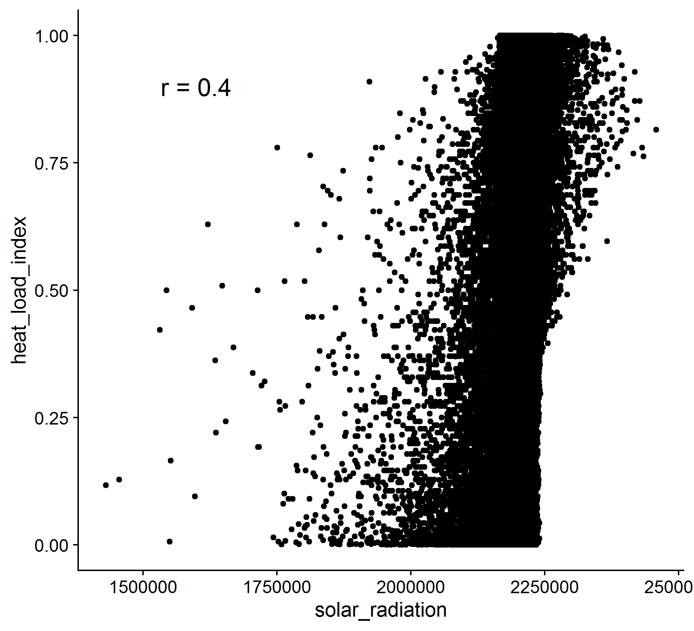

# DK Nationwide LiDAR Documentation

*Version 0.4*

*Work in progress...*

**Authors:** Jakob J. Assmann, Urs A. Treier, Andràs Zlinsky, Jesper E. Moeslund and Singe Normand

## Content
- [Dataset Description](#dataset-description)
- [Overview variables](#overview-variables)
- [Pointcloud derived variables](#pointcloud-derived-variables)
- [Terrain model derived variables](#terrain-model-derived-variables)
- [Auxillary files](#auxillary-files)

## Dataset Description

This dataset contains ecological and landscape descriptors extracted from the pointclouds of Denmark's nationwide LiDAR dataset *'Punktsky'* collected in winter 2014/15. The raw point clouds can be accessed on the website of [Kortforsyningen](#https://download.kortforsyningen.dk/content/dhmpunktsky) and documentation for the raw data is available [here](#https://kortforsyningen.dk/sites/default/files/old_gst/DOKUMENTATION/Data/dk_dhm_punktsky_v2_jan_2015.pdf) and [here](#https://sdfe.dk/hent-data/danmarks-hoejdemodel/). 

The purpose of this dataset is to provide a light-weight version of the nationwide data containing easy to interpretable descriptors that summarise the structure of the point cloud data for ecological and biological studies. 

The extent of the dataset comprises the majority of the Danish land surface (including many of the small islands and Bornholm) split into 49 598 tiles. The data is provided as GeoTIFF rasters projected in ETRS 96 UTM32 (EPSGS:7019). NoData values are globally set to -9999, but please see the description on how to interpet the NoData cells for the individual variables. Masks for sea and small in-land water bodies are provided, but have to be applied manually where appropiate. 

This document describes the **\[INSERT TOTAL NUMBER\]** ecological and landscape variables extracted by us and how they were derived mathematically. We also highlight any known issues relevant to the interpretation of these variables.

## Overview
The section provides a quick overview of all outputs and auxillary files.

**Pointcloud derived variables**

The data source for these variables are the raw point clouds provided by Kortforsyningen.

| variable name | average file size | average processing time |
| ---- | ---- | ---- |
| [amplitude\_mean and amplitude\_sd](#amplitude_mean-and-amplitude_sd) | 46 kb (2x) | 75 s |
| [canopy\_height](#canopy_height) | 42 kb | 51 s |
| [normalized\_z\_mean and normalized\_z\_sd](#normalized_z_mean-and-normalized_z_sd)| 50 kb (2x) | 60 s |
| [point\_counts](#point_counts) | 10 kb (28 x) | 25 min (50 s per count) |
| [point\_source\_info](#point_source_info) | 110 kb (4x) | 5 min 10 s |
| [proportions](#proportions) | 19 kb (25x) | 35 s |

**Terrain model derived variables**

The data source for these variables are digital terrain model rasters derived from the raw point clouds at a 0.4 m grain size. These rasters are directly provided by Kortforsyningen and can be found [here](#https://download.kortforsyningen.dk/content/dhmterr%C3%A6n-04-m-grid).

| variable name | average file size | average processing time |
| ---- | ---- | ---- |
| [aspect](#aspect) | 20 kb | 9 s |
| [dtm\_10m](#dtm_10m) | 20 kb | 2 s |
| [heat\_load\_index](#heat_load_index) | 20 kb | 1 s |
| [openness\_difference](#openness_difference) | 20 kb | 5 s |
| [openness\_mean](#openness_mean) | 20 kb | 5 s |
| [slope](#slope) | 20 kb | 8 s |
| [solar\_radiation](#solar_radiation) | 20 kb | 4 s |
| [wetness\_index](#wetness_index) | 20 kb | 1h to 1h 30 min |

**Note:** Processing times are given per tile on a single core and are provided for development purposes only **[to be removed in final documentation]**. The time does not include processess and file managment times (i.e. copying to and from server etc) or multicore parallel processing.

Processing times speeds up things dramatically, with 54 cores it takes about and average of 1 min 15 s to process one tile. For all 49 000 tiles the processing is therefore expected to take 42.5 days.  

The total data size estimate accumulates to: 1589 kb per tile in total, which translates to 77861000 kb ~ 79 GB for all 49k tiles.

**Auxillary Files**

Files to support data access and handling.

| file name | description |
| ---- | ---- |
| [water masks](#water-masks) | Sea and inland water masks for each tile |
| [tile footprints](#tile-footprints) | Tile footprints, allows for targeted subsetting of dataset |

[Back to content.](#content)

----
## Pointcloud derived variables

### amplitude\_mean and amplitude\_sd
**Folder locations:** `/outputs/amplitude/mean` and `/outputs/amplitude/sd`

**File names:** `amplitude_mean_xxxx_xxx.tif` and `amplitude_sd_xxxx_xxx.tif` 

**File type and units:** `32-bit float, undefined`

**Description:**

Arithmetic mean and standard deviation of the return amplitude for all points within a 10 m x 10 m grid cell.

In the context of LiDAR, the amplitude represents the strenght of the signal received by the sensor for each return. For this variable the arithmetic mean and standard deviation of the amplitude are calculated for all points within a 10 m x 10 m cell. Calculations are carried out for a single tile using the [OPALS Cell module](https://opals.geo.tuwien.ac.at/html/stable/ModuleCell.html). Here, all points referes exactly to the following set of classes: ground, water, building, as well as low\-, medium\- and high\-vegetation.  

**Issues:**
- The amplitude variable is very difficult to interpret biologically.
- Amplitude is not directly comparable across flight strips due to differences in sensor etc. As some cells may contain returns from up to four different flight strips, we recommend using the amplitude variable in conjunction with information on the flight strip ids within each cell contained in the point\_source\_info variables.

**References:**
No specific references available.

[Back to content.](#content)

----
### canopy\_height
**Folder location:** `/outputs/canopy_height`

**File name:** `canopy_height_xxxx_xxx.tif` 

**File type and units:** `16 bit integer, metre x 100`

**Description:**

Canopy height calculated as the 95th-percentile of the normalised height above ground of all vegetation points within a 10 m x 10 m cell.

Calculated with [OPALS Cell](https://opals.geo.tuwien.ac.at/html/stable/ModuleCell.html) for each tile individually. Vegetation points consist of the following classes: low\-, medium\- and high\- vegetation. Should there be no vegetation points in any given cell the value of the cell is set to zero.

**Issues:**
- If a cell contains no points the value is set to zero, not NA.

**References:**
No specific references available.

[Back to content.](#content)

----
### normalized\_z\_mean and normalized\_z\_sd
**Folder locations:** `/outputs/normalized_z/mean` and `/outputs/normalized_z/sd`

**File names:** `normalized_z_mean_xxxx_xxx.tif` and `normalized_z_sd_xxxx_xxx.tif` 

**File type and units:** `16-bit integer, metre x 100` and `16-bit integer, metre x 100`

**Description:**

Arithmetic mean and standard deviation of the mean height above ground (normalised z) for all points in a 10 m x 10 m grid cell.

A normalised z attribute for each point is added to the point cloud of a single tile using [OpalsAddInfo](https://opals.geo.tuwien.ac.at/html/stable/ModuleAddInfo.html). To do so the absolute height above sea-level of a point is substracted by the absolute height of the underlying cell of the 0.4 m digital terrain model. The arithmetic mean and standard deviation of the normalized_z are then calculated for all points within a 10 m x 10 m cell. These calculations are carried out with the [OPALS Cell module](https://opals.geo.tuwien.ac.at/html/stable/ModuleCell.html). Here, all points referes to the following set of classes: ground, water, building, as well as low\-, medium\- and high\-vegetation (classes 2,3,4,5,6,9).  

The American spelling of the variable name is kept for legacy reasons. 

**Issues:**
- If a cell contains no points the value is set to zero, not NA.

**References:**
No specific references available.

[Back to content.](#content)

----
### point\_counts
**Folder locations:** `/outputs/point_count/point_count_name` 

**File names:** `point_count_name_xxxx_xxx.tif`

**File type and units:** `16-bit integer, absolute count`

**Description:**

Absolute number of points within a 10 m x 10 m cell. Extracted for a combination of point classes and above height ranges specified below.
 
The "punktsky" point clouds were pre-classified by Geodatasyrelsen. The following point counts were extracted using the [OPALS Cell module](https://opals.geo.tuwien.ac.at/html/stable/ModuleCell.html) with filters applied for the respective height ranges and point classses.

**General point counts:**

| name | height range | point classes |
| ---- | ---- | ---- |
| ground\_point\_count\_\-1m\-1m | \-1 m to 1 m | ground points (class 2) | 
| water\_point\_count\_\-1m\-1m | \-1 m to 1 m | water points (class 9) | 
| ground\_and\_water\_point\_count\_\-1m\-1m | \-1 m to 1 m | ground and water points (classes 2,9) | 
| vegetation\_point\_count\_00m\-50m | 0 m to 50 m | vegetation points (classes 3,4,5) | 
| building\_point\_count\_\-1m\-50m | \-1 m to 50 m | building points (class 6) | 
| total\_point\_count\_\-1m\-50m | \-1 m to 50 m | ground, water, vegetation and building points (classes 2,3,4,5,6,9) | 

**Vegetation point counts for height bins:**
| name | height range | point classes |
| ---- | ---- | ----|
| vegetation\_point\_count\_00.0m\-00.5m | 0.0 m to 0.5 m | vegetation points (classes 3,4,5) |
| vegetation\_point\_count\_00.5m\-01.0m | 0.5 m to 1.0 m | vegetation points (classes 3,4,5) | 
| vegetation\_point\_count\_01.0m\-01.5m | 1.0 m to 1.5 m | vegetation points (classes 3,4,5) | 
| vegetation\_point\_count\_01.5m\-02.0m | 1.5 m to 2.0 m | vegetation points (classes 3,4,5) | 
| vegetation\_point\_count\_02m\-03m | 2 m to 3 m | vegetation points (classes 3,4,5) | 
| vegetation\_point\_count\_03m\-04m | 3 m to 4 m | vegetation points (classes 3,4,5) | 
| vegetation\_point\_count\_04m\-05m | 4 m to 5 m | vegetation points (classes 3,4,5) |  
| vegetation\_point\_count\_05m\-06m | 5 m to 6 m | vegetation points (classes 3,4,5) | 
| vegetation\_point\_count\_06m\-07m | 6 m to 7 m | vegetation points (classes 3,4,5) | 
| vegetation\_point\_count\_07m\-08m | 7 m to 8 m | vegetation points (classes 3,4,5) |
| vegetation\_point\_count\_08m\-09m | 8 m to 9 m | vegetation points (classes 3,4,5) | 
| vegetation\_point\_count\_09m\-10m | 9 m to 10 m | vegetation points (classes 3,4,5) |
| vegetation\_point\_count\_10m\-11m | 10 m to 11 m | vegetation points (classes 3,4,5) |  
| vegetation\_point\_count\_11m\-12m | 11 m to 12 m | vegetation points (classes 3,4,5) | 
| vegetation\_point\_count\_12m\-13m | 12 m to 13 m | vegetation points (classes 3,4,5) | 
| vegetation\_point\_count\_13m\-14m | 13 m to 14 m | vegetation points (classes 3,4,5) |  
| vegetation\_point\_count\_14m\-15m | 14 m to 14 m | vegetation points (classes 3,4,5) |  
| vegetation\_point\_count\_15m\-16m | 15 m to 16 m | vegetation points (classes 3,4,5) | 
| vegetation\_point\_count\_16m\-17m | 16 m to 17 m | vegetation points (classes 3,4,5) | 
| vegetation\_point\_count\_17m\-18m | 17 m to 18 m | vegetation points (classes 3,4,5) |  
| vegetation\_point\_count\_18m\-19m | 18 m to 19 m | vegetation points (classes 3,4,5) | 
| vegetation\_point\_count\_19m\-20m | 19 m to 20 m | vegetation points (classes 3,4,5) | 
| vegetation\_point\_count\_20m\-25m | 20 m to 25 m | vegetation points (classes 3,4,5) |  
| vegetation\_point\_count\_25m\-50m | 25 m to 50 m | vegetation points (classes 3,4,5) |

**Additional information:**


**Figure:** A set of canopy examples for visualisation of the point count variables. The approximate height of large bounding boxes is 25 m. a) agricultural field with no / very low vegetation, b) understory / shrub layer in mixed broadleaf woodland, c) dense young-ish coniferous forest (plantation?), d) old and tall mixed broadleaf woodland. 


**Figure:** Example of the behaviour of returns from shallow waters in a froest pond / marsh area. a) prespective view of the forest pond (pink bounding box has a 10 m x 10 m footprint), b) orthophotograph at nadir view, c) point count intensity of the derived water point count variable (black = low count, white = heigh count), d) nadir view of point cloud. Plesse notice particularly the many missing returns from the regions in the pond with deep water.

**Issues:**
- Water returns only come from shallow water and even these may not be consistent. 
- This might introduce inaccuracies and edge effects associated with water bodies.
- Any empty cell (e.g. over deep water) will return zero for all point counts and not NA.

**References:**
- Point classification outlined in: Geodatastyrelsen 2015. Danmarks Højdemodel, DHM/Punktsky Data version 2.0 - Januar 2015. Accessed online [7 March 2020]. https://kortforsyningen.dk/sites/default/files/old_gst/DOKUMENTATION/Data/dk_dhm_punktsky_v2_jan_2015.pdf

[Back to content.](#content)

----

### point\_source\_info
**Folder locations:** 
- `/outputs/point_source_info/point_source_counts/`
- `/outputs/point_source_info/point_source_ids/`
- `/outputs/point_source_info/point_source_nids`
- `/outputs/point_source_info/point_source_proportion`

**File name:** `point_source_info_name_xxxx_xxx.tif`

**Filte type and units:**
- `point_source_counts - 16 bit integer, count`
- `point_source_ids - 16 bit integer, flight strip ID`
- `point_source_nids - 16 bit integer, count` 
- `point_source_proportion - 16 bit integer, ratio x 10000`

**Description:**

Four descriptor variables for the points sources (flight strip ids) in each 10 m x 10 m cell. 

This information may be helpful for interpreting any variable that might be affected by the flight strip id as a covariate. The flight strip id represents: a) differences between sensors / aircrafts that may have been used during the nationwide LiDAR campaign, b) differences in aquistion time and date, c) differences in view point / aquisition angle of the cells. 

- `point_source_counts` \- Contains the number of points per 10 m x 10 m cell for each flight strip id in a tile. In this multi-layer raster each layer represents the point counts for one flight strip id in the tile. The order of layers matches those in the `point_source_ids` raster, which can be used for matching the point counts to the flight strip ids.
- `point_source_ids` \- Multi-layer raster containing one layer for each flight strip found in a tile. The presence of a point of the relevant flight strip is indicated by the presence of a string containing the flight strip id in the cell. This layer can be used to match the layers of the `point_source_counts` and `point_source_proportions` layers to a flight strip id.
- `point_source_nids` \- Single layer raster containing the number of different point source ids in each cell. 
- `point_source_proportions` \- Mulit-layer raster containing the proportion of point counts for a given point source id per 10 m x 10 m cell. The order of layers corresponds to those in `point_source_ids`, which can be used to match the proportions to a given point source id. 

**Issues:**
No known issues so far. 

**References:**
No relevant references.

[Back to content.](#content)

----

### proportions
**Folder locations:** `/outputs/proportion/proportion_name` 

**File names:** `proportion_name_xxxx_xxx.tif`

**File type and units:** `16-bit integer, ratio x 10000`

**Description:**

Simple ratios between selected [point counts](#point\_counts) for each 10 m x 10 m cell.

**General proportions:**
| name | ratio |
| ---- | ---- |
| canopy\_openness | ground and water points (\-1 m to 1 m; classes 2,9) / all points (\-1 m to 50 m; classes 2,3,4,5,6,9) | 
| vegetation\_density | vegetation points (0 m to 50 m; classes 3,4,5) / all points (\-1 m to 50 m; classes 2,3,4,5,6,9) | 
| building\_proportion | building points (\-1 m to 50 m; class 6) / all points (\-1 m to 50 m; classes 2,3,4,5,6,9) |

**Vegetation proportions for height bins:**

These proportions were calculated between the vegetation point count in the respective height bin and the total vegetation point count (0 m to 50 m) in a cell. Vegetation points refer to classes 3, 4 and 5. 

| name | height range |
| ---- | ---- |
| vegetation\_proportion\_00.0m-00.5m | 0.0 m to 0.5 m |
| vegetation\_proportion\_00.5m-01.0m | 0.5 m to 1.0 m | 
| vegetation\_proportion\_01.0m-01.5m | 1.0 m to 1.5 m | 
| vegetation\_proportion\_01.5m-02.0m | 1.5 m to 2.0 m | 
| vegetation\_proportion\_02m-03m | 2 m to 3 m | 
| vegetation\_proportion\_03m-04m | 3 m to 4 m | 
| vegetation\_proportion\_04m-05m | 4 m to 5 m | 
| vegetation\_proportion\_05m-06m | 5 m to 6 m |  
| vegetation\_proportion\_06m-07m | 6 m to 7 m |  
| vegetation\_proportion\_07m-08m | 7 m to 8 m | 
| vegetation\_proportion\_08m-09m | 8 m to 9 m | 
| vegetation\_proportion\_09m-10m | 9 m to 10 m | 
| vegetation\_proportion\_10m-11m | 10 m to 11 m |
| vegetation\_proportion\_11m-12m | 11 m to 12 m |
| vegetation\_proportion\_12m-13m | 12 m to 13 m | 
| vegetation\_proportion\_13m-14m | 13 m to 14 m | 
| vegetation\_proportion\_14m-15m | 14 m to 14 m | 
| vegetation\_proportion\_15m-16m | 15 m to 16 m | 
| vegetation\_proportion\_16m-17m | 16 m to 17 m | 
| vegetation\_proportion\_17m-18m | 17 m to 18 m |  
| vegetation\_proportion\_18m-19m | 18 m to 19 m | 
| vegetation\_proportion\_19m-20m | 19 m to 20 m | 
| vegetation\_proportion\_20m-25m | 20 m to 25 m | 
| vegetation\_proportion\_25m-50m | 25 m to 50 m |
  
**Issues:**
- Mathematically invalid divisons may occur (i.e. division by zero) if a cell is empty for the point class in the denominator of the ratio. In this case a value of zero is assigned to the cell and not NA. 

**References:**
- van Leeuwen, M., Nieuwenhuis, M., 2010. Retrieval of forest structural parameters using LiDAR remote sensing. Eur J Forest Res 129, 749–770. https://doi.org/10.1007/s10342-010-0381-4
- Sasaki, T., Imanishi, J., Ioki, K., Morimoto, Y., Kitada, K., 2008. Estimation of leaf area index and canopy openness in broad-leaved forest using an airborne laser scanner in comparison with high-resolution near-infrared digital photography. Landscape Ecol Eng 4, 47–55. https://doi.org/10.1007/s11355-008-0041-8
- Sasaki, T., Imanishi, J., Ioki, K., Song, Y., Morimoto, Y., 2016. Estimation of leaf area index and gap fraction in two broad-leaved forests by using small-footprint airborne LiDAR. Landscape Ecol Eng 12, 117–127. https://doi.org/10.1007/s11355-013-0222-y
- Melin, M., Hinsley, S.A., Broughton, R.K., Bellamy, P., Hill, R.A., 2018. Living on the edge: utilising lidar data to assess the importance of vegetation structure for avian diversity in fragmented woodlands and their edges. Landscape Ecol 33, 895–910. https://doi.org/10.1007/s10980-018-0639-7

[Back to content.](#content)

----
## Terrain model derived variables

### aspect
**Folder location:** `/outputs/aspect`

**File name:** `aspect_xxxx_xxx.tif`

**File type and units:** `16-bit integer, degrees`

**Description:**

Aspect in degrees with 0° indicating North, 90° East, 180° South and 270° West. Flat areas are assigned an aspect of 0°. Values represent the median aspect found in a 10 m x 10 m cell. 

Calculated using [`gdaldem aspect`](https://gdal.org/programs/gdaldem.html) for the 0.4 m DTM rasters. To avoid edge effects, all calculations are done on a mosaic including the target tile and all available directly neighbouring tiles (maxium 8). The "-zero-for-flat" option of `gdaldem` is used to assign zeros to flat areas. The outputs are aggregated to 10 m using the median value of all 0.4 m cells within a given 10 m cell. Finally, the value for each cell is converted from radian to degrees and rounded to the nearest integer. 

**Issues:**
- Should a neighbourhood mosaic be incomplete (i.e. less than eight neighbouring tiles), very small edge effects may occur. The reason for this is that no aspect can be derived for the outer rows and collums of the 0.4 m DTM mosaic. These cells will have no neighbourhing cells and `gdaldem` assigns a value of zero to these cells. But these zero values will only have a mild effect on the median value of a 10 m cell and will only affect the corners of the tile where no neighbouring tiles are available (very few tiles), where they will cause a small artificial deflation of the median aspect in those corner cells.

**References:**
No relevant references.

[Back to content.](#content)

----

### heat\_load\_index
**Folder location:** `/outputs/heat_load_index`

**File name:** `heat_load_index_xxxx_xxx.tif`

**File type and units:** `16-bit integer, unitless x 10000`

**Description:**

Heat load index calculated following McCune and Keon (2002). Index purely based on the aspect of a cell, ranging from zero (North slopes) to 1 (South slopes).

Calculated from the 10 m [aspect](#aspect) rasters following the equation specified in McCune and Keon (2002): 

```heat_load_index = (1 - cos((radians(A)-45)))/2```

where `A is the aspect in degrees. The value is then stretched by a factor of 10000, rounded to the nearest integer and converted into a 16 bit integer. 

**Additional Information:**



**Figure:** Illustrating the correlation between solar radiation and heat load index, both variables are moderately correlated (r = 0.49), but the solar radiation value seems to contain more information and is deemed better by the authors. 

**[Jakob: I think it would make sense to only include one of these two variables, and following the authors we should keep the solar radiation variable.]**

**Issues:**
- Small edge effects for tiles with incomplete neighbourhoods, propagated from the aspect calculations.

**References:**
- McCune, B., Keon, D., 2002. Equations for potential annual direct incident radiation and heat load. Journal of Vegetation Science 13, 603–606. https://doi.org/10.1111/j.1654-1103.2002.tb02087.x

[Back to content.](#content)

----
### openness\_mean
**Folder location:** `/outputs/openness_mean`

**File name:** `openness_mean_xxxx_xxx.tif`

**File type and units:** `16-bit integer, degrees`

**Description:**

Landscape openness calculated following Yokoyama et al. 2002 using the OPALS Openness module and a search radius of 150 m. Landscape openness is a landform descriptor that indicates whether a cell is located in a valley, depression or on a ridge. 

First, the 0.4 m DTM is aggregated to a grain size of 10 m. To reduce edge effects in subsequent calculations, this aggregation is carried out for a mosaic including the target tile and all available tiles in the direct neighbourhood (max. eight neighbouring tiles). The mean of the positive openness for all eight cardinal directions with search radius of 150 m is then calculated for all cells in the tile mosaic using the [OPALS Openness module](https://opals.geo.tuwien.ac.at/html/stable/ModuleOpenness.html) (feature = 'positive', kernelSize = 15 and selMode = 0). The output is cropped to the extent of the target tile. 
Should the neighbourhood mosaic be incomplete, i.e. contain less than eight neighbouring tiles, cells within the first 150 m of all edges where a neighbourhood tile is missing are masked out (set to NA). Finally, the mean openness per cell is converted from radians to degrees and rounded to the nearest full degree. 

**Issues:**
- Cells with incomplete neighbourhoods will have NA values assigned for the first 15 cells (150 m) on the borders with missing neighbours. 

**References:**
- Yokoyama, R. / Shirasawa, M. / Pike, R.J. (2002): Visualizing topography by openness: A new application of image processing to digital elevation models. Photogrammetric Engineering and Remote Sensing, Vol.68, pp.251-266.

[Back to content.](#content)

----

### openness\_difference
**Folder location:** `/outputs/openness_difference`

**File name:** `openness_difference_xxxx_xxx.tif`

**File type and units:** `16-bit integer, degrees`

**Description:**

Min/max difference in landscape openness based on Yokoyama et al. 2002 calculated using the OPALS Openness module and a search radius of 50 m. Indicates presence / absence of linear landscape features. 

First, the 0.4 m DTM is aggregated to a grain size of 10 m. To reduce edge effects in subsequent calculations, this aggregation is carried out for a mosaic including the target tile and all available tiles in the direct neighbourhood (max. eight neighbouring tiles). The min and max of the positive openness for all eight cardinal directions within a search radius of 50 m are then calculated for all cells in the tile mosaic using the [OPALS Openness module](https://opals.geo.tuwien.ac.at/html/stable/ModuleOpenness.html) (feature = 'positive', kernelSize = 5 and selMode = 1/2). Next, the min & max values are converted to degrees, the difference is calculated and the result rounded to the nearest full degree. The output is cropped to the extent of the target tile. Should the neighbourhood mosaic be incomplete, i.e. contain less than eight neighbouring tiles, cells within the first 50 m of all edges where a neighbourhood tile is missing are masked out (set to NA). 

**Issues:**

- Cells with incomplete neighbourhoods will have NA values assigned for the first 5 cells (50 m) on the borders with missing neighbours. 

**References:**
- Yokoyama, R. / Shirasawa, M. / Pike, R.J. (2002): Visualizing topography by openness: A new application of image processing to digital elevation models. Photogrammetric Engineering and Remote Sensing, Vol.68, pp.251-266.

[Back to content.](#content)

----

### slope
**Folder location:** `/outputs/slope`

**File name:** `slope_xxxx_xxx.tif`

**File type and units:** `16-bit integer, degrees`

**Description:**

Slope in degrees at 10 m grain size derived from the 0.4 m DTM. Values represent the median aspect of all 0.4 m cells found in a 10 m x 10 m cell. 

Calculated using [`gdaldem slope`](https://gdal.org/programs/gdaldem.html) on the original 0.4 m grain size DTM rasters. To avoid edge effects all calculations are done on a mosaic including the target tile and all available directly neighbouring tiles (maxium eight). The ouptus are aggregated to 10 m using the median value of all 0.4 m cells within a 10 m cell, which is then rounded to the nearest integer. 

**Issues:**
- Should a neighbourhood mosaic be incomplete (i.e. less than eight neighbouring tiles), very small edge effects may occur. The reason for this is that no slope can be derived for the outer rows and collums of the 0.4 m DTM mosaic. These cells will have no neighbourhing cells and `gdaldem` assigns a value of zero to these cells. But these zero values will only have a mild effect on the median value of a 10 m cell and will only affect the corners of the tile where no neighbouring tiles are available (very few tiles), where they will cause a small artificial deflation of the median slope in those corner cells.

**References:**
No relevant references.

[Back to content.](#content)

----

### solar\_radiation
**Folder location:** `/outputs/solar_radiation`

**File name:** `solar_radiation_xxxx_xxx.tif`

**File type and units:** `16-bit integer, ln(MJ x cm^-2 x yr^–1) x 1000`

**Description:**

Incident solar radiation estimated following McCune and Keon (2002). 

Calculated from the 10 m [aspect](#aspect) and [slope](#aspect) rasters using equation 3 specified by McCune and Keon (2002): 

```solar_radiation = 0.339 + 0.808 x cos(radians(L)) x cos(radians(S)) - 0.196 x sin(radians(L)) x sin(radians(S)) - 0.482 * cos(radians(180 - absolute(180 - A))) x sin(radians(S))))```

where `L` is the centre latitude of the cell in degrees, `S` is the slope of the cell in degrees and `A` is the aspect of the cell in degrees. The value is then stretched by a factor of 1000, rounded to the nearest integer and converted into a 16 bit integer. 

**Additional Information:**


**Figure:** Illustrating the correlation between solar radiation and heat load index, both variables are moderately correlated (r = 0.49), but the solar radiation value seems to contain more information and is deemed better by the authors. 

**[Jakob: I think it would make sense to only include one of these two variables, and following the authors we should keep the solar radiation variable.]**

**Issues:**
- Small edge effects for tiles with incomplete neighbourhoods, propagated from the aspect and slope calculations.

**References:**
- McCune, B., Keon, D., 2002. Equations for potential annual direct incident radiation and heat load. Journal of Vegetation Science 13, 603–606. https://doi.org/10.1111/j.1654-1103.2002.tb02087.x

[Back to content.](#content)

----

### wetness_index

**!!! THIS VARIABLE IS CURRENTLY NOT INCLUDED IN THE PIPELINE, CALCULATIONS TAKE 1-2h PER TILE !!!**

**Folder location:** `/outputs/wetness_index/`

**File name:** `wetness_index_xxxx_xxx.tif`

**File type and units:** `32 bit float, unitless index`

**Description:**

SAGA wetness index calculated with default settings. 

The SAGA wetness index is an optimised version of the commonly used TWI. To reduce edge effects, the wetness index is caluclated for a mosaic including the target tile and all directly neighbouring tiles that are available (max. 8 neighbours). The resulting output is then corpped to the target tile, stretched by a factor of 1000 and rounded to the next full integer. Please visit the [SAGA Documentation for ta\_hydrology 15](http://www.saga-gis.org/saga_tool_doc/2.3.0/ta_hydrology_15.html) for a detailed description of the module. 

**Issues:**
- Tiles with incomplete neighbourhoods (i.e. less than 8 direct neighbours are avialable) will suffer from edge effects in the direct vicinity of the relevant border. 
- Flow accumulation is only calculated for the tile neighbourhood. Even in the ideal case of the neighbourhood being complete, for most cells flow accumulation is therefore calculated only within a 10 km distance. This should not matter in most cases, but is worth noting.

**References:**
- Boehner, J., Koethe, R. Conrad, O., Gross, J., Ringeler, A., Selige, T. (2002): Soil Regionalisation by Means of Terrain Analysis and Process Parameterisation. In: Micheli, E., Nachtergaele, F., Montanarella, L. [Ed.]: Soil Classification 2001. European Soil Bureau, Research Report No. 7, EUR 20398 EN, Luxembourg. pp.213-222.
- Boehner, J. and Selige, T. (2006): Spatial prediction of soil attributes using terrain analysis and climate regionalisation. In: Boehner, J., McCloy, K.R., Strobl, J. [Ed.]: SAGA - Analysis and Modelling Applications, Goettinger Geographische Abhandlungen, Goettingen: 13-28.

[Back to content.](#content)

----

### saga\_openness\_mean

**!!! This variable was calculated as a preformance comparsion to the OPALS openness module, speeds are comparable and this entry will eventually be discarded !!!**
**Folder location:** *currently no folder location*

**File name:** *currently no file name*

**Description:**

Landscape openness calculated following Yokoyama et al. 2002 using SAGA GIS with a search radius of 150 m. 

First, the 0.4 m DTM is aggregated to a grain size of 10 m. To reduce edge effects in subsequent calculations, this aggregatioon is carried out for a mosaic including the target tile and all available tiles in the direct neighbourhood (max. 8 neighbouring tiles). The mean of the positive openness for all eight cardinal directions with search radius of 150 m is then calculated for all cells in the tile mosaic using the SAGA GIS "ta\_lighting 5" module. The output is cropped to the extent of the target tile. Should the neighbourhood mosaic be incomplete, i.e. contain less than 8 neighbouring tiles, cells within the first 150 m of the edges where a 
neighbourhood tile is missing are masked out (set to NA). Finally, the mean openness per cell is converted from radians to degrees and rounded to the nearest full degree. Please visit the [SAGA Documentation on ta\_lighting 5](http://www.saga-gis.org/saga_tool_doc/2.3.0/ta_lighting_5.html) for additional detail about the module. 

**Issues:**

No known issues with this variable.

**References:**
- Yokoyama, R. / Shirasawa, M. / Pike, R.J. (2002): Visualizing topography by openness: A new application of image processing to digital elevation models. Photogrammetric Engineering and Remote Sensing, Vol.68, pp.251-266.
- Anders, N. S. / Seijmonsbergen, A. C. / Bouten, W. (2009): Multi-Scale and Object-Oriented Image Analysis of High-Res LiDAR Data for Geomorphological Mapping in Alpine Mountains. Proceedings of Geomorphometry 2009.
- Prima, O.D.A / Echigo, A. / Yokoyama, R. / Yoshida, T. (2006): Supervised landform classification of Northeast Honshu from DEM-derived thematic maps. Geomorphology, vol.78, pp.373-386.

[Back to content.](#content)

----

## Auxillary files

----

### water masks

**Folder locations:** `/outputs/masks/inland_water_mask` and `/outputs/masks/sea_mask` 

**File names:** `inland_water_mask_xxxx_xxx.tif` and `sea_mask_xxxx_xxx.tif`

**File type and units:** `16-bit integer, binary (1 = water and no data)`

**Description:**

Sea and inland water masks for each tile.

Generated from polygon shapefiles assembled by Jesper Moeslund (AU Department of Bioscience - Biodiversity and Conservation). Fore each tile the polygon geometries were burned into the 10 m x 10 m grid using gdal_rasterize. 

**Issues:**
- Shape, outline, presence and absence of small water bodies and coastlines may fulctuate over time. The masks were chosen to present a snapshot of the water bodies as close to the timepoint of the LiDAR data aquistion as possible (winter 2014/2015), but inaccuracies may still arise.
- The inland water masks was produced to be as comprehensive as possible, but some small ponds and water bodies might have been missed.

**References:**
No relevant references.

[Back to content](#content).

----

### tile footprints

To be filled. 
